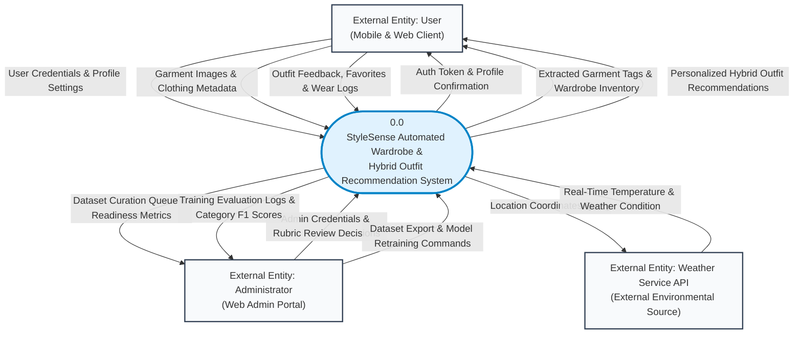
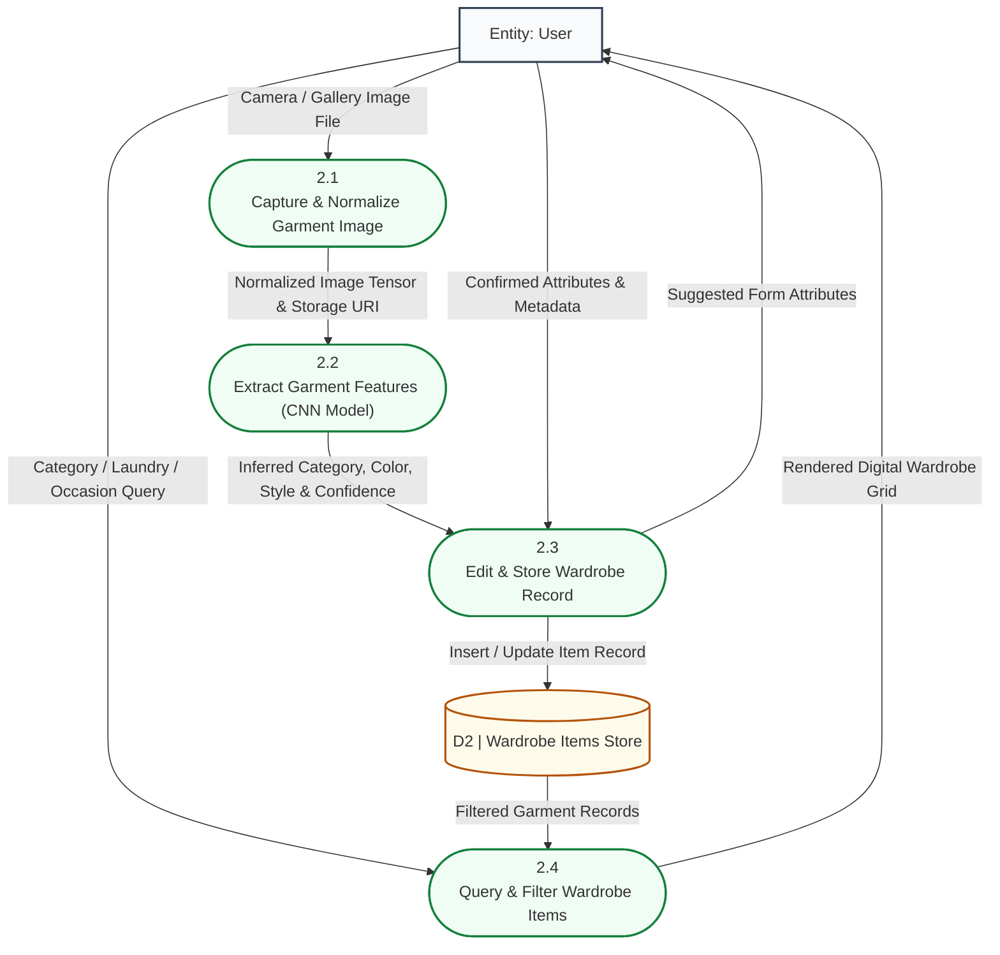
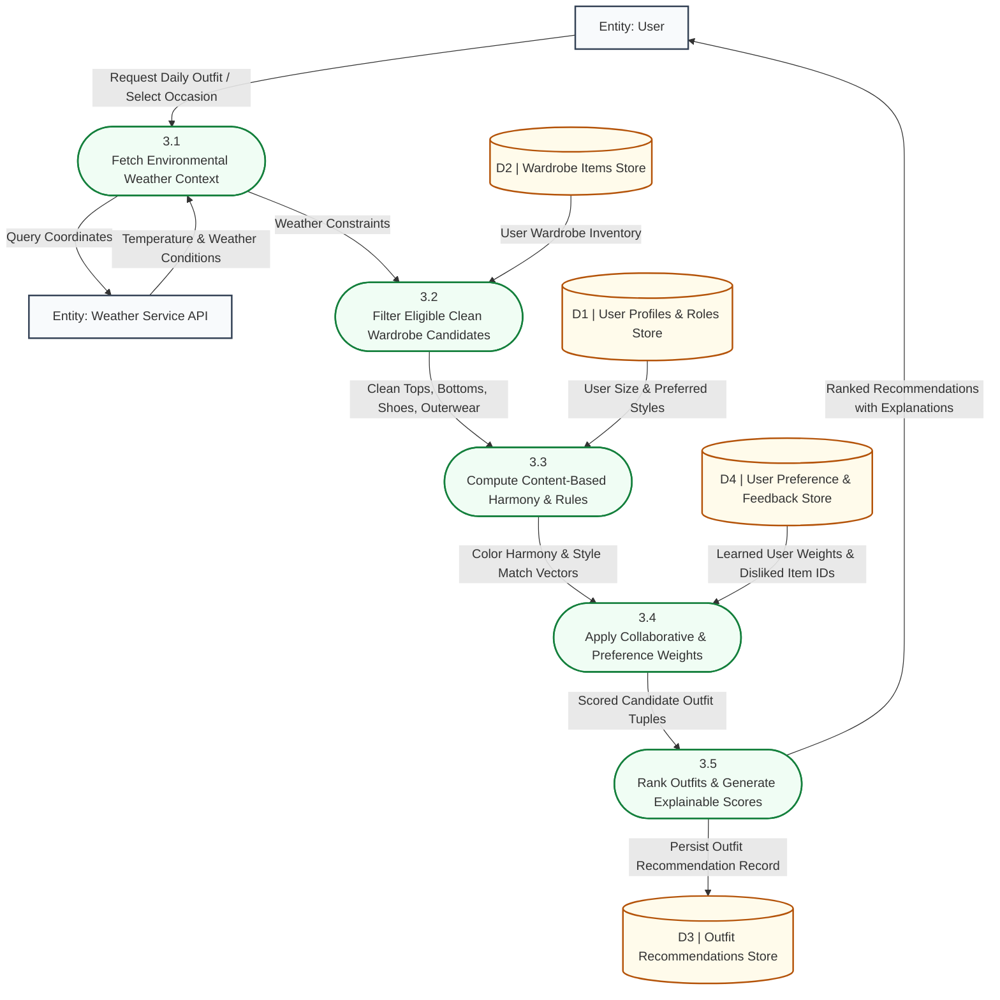
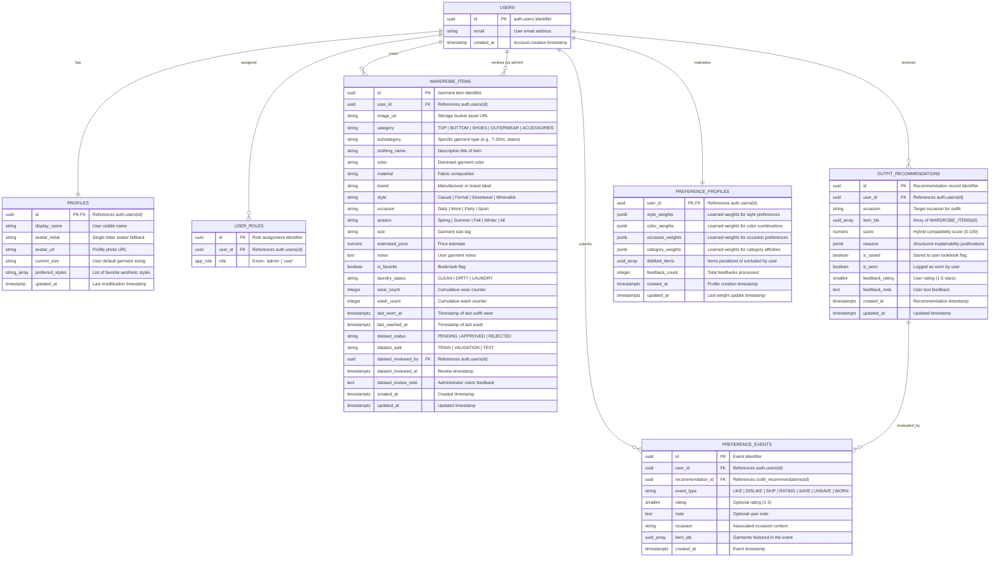

**UNIVERSITY OF MAKATI**

**DEVELOPMENT OF STYLESENSE: AN IMAGE-BASED WARDROBE**  
**AND OUTFIT RECOMMENDER USING HYBRID**   
**FILTERING TECHNIQUES**

A thesis submitted to the faculty of College of Computing  
and Information Sciences in candidacy for the Degree of  
Bachelor of Science in Computer Science  
(Application Development Elective Track)

DEPARTMENT OF COMPUTER SCIENCE

BY  
**FRANCIS MICO H CABRERA**  
**JONATHAN DAVIS DY**  
**SHELOH M. GALLER**  
**MARCO ANTONIO T. LASAGA**

In Partial Fulfillment  
of the Requirements for the Degree  
BACHELOR OF SCIENCE IN COMPUTER SCIENCE

#  August 2026

# **CHAPTER III** 

# **DESIGN AND METHODOLOGY**

This chapter of the paper presents an overview of the proposed study's fundamental theoretical foundations. The research framework is guided by these foundations in order to give substantial results to the research questions at the conclusion of the study. It was also utilized to monitor the progression of the system's workflow.

# **Research Design**

This study employs a developmental, applied, and descriptive evaluative research design in order to effectively address the objectives of the study and provide a comprehensive approach to solving the identified problem. The combination of these methodologies allows the researchers to look at the problem from both a theoretical and a hands-on practical perspective, making sure that StyleSense ends up being not just technically sound but genuinely functional, useful, and relevant to the everyday needs of its target users.

Developmental research is utilized in this study to guide the entire process of designing, building, refining, and evaluating StyleSense as a web-based wardrobe and outfit recommendation system. This methodology is all about the systematic creation and continuous improvement of the system throughout the development process — it's not just about building something once and calling it done, but about constantly analyzing how the system is progressing, identifying what needs to be improved, and making sure the final output actually lines up with what the study set out to achieve. Through developmental research, the team is able to track the evolution of StyleSense from an initial concept all the way through to a fully functional and evaluated prototype, making informed adjustments along the way based on testing results, user feedback, and performance data. 

Applied research is employed because at the end of the day, this study isn't just about exploring ideas or theories — it's about building something that actually works and actually helps real people with a real everyday problem. This methodology is what keeps the study grounded in practical reality, emphasizing the application of existing technologies, algorithms, and frameworks to create a functioning system that directly addresses the needs of students and budget-conscious individuals who struggle with making the most of their existing wardrobe. In this study, applied research supports the implementation of hybrid filtering techniques — specifically content-based and collaborative filtering — alongside image processing and deep learning tools like TensorFlow, Keras, and OpenCV, in developing StyleSense as a practical and accessible solution to the identified problem.

Descriptive evaluative research is utilized to describe, analyze, and evaluate how well the developed system actually performs and how real users experience interacting with it. This methodology is what gives the study its ability to go beyond just building something and actually measure whether it works the way it's supposed to. It allows the researchers to gather relevant information through user surveys, system testing, and direct observation in order to assess user satisfaction, system functionality, recommendation accuracy, and overall usability in a structured and meaningful way. Rather than just assuming the system works because it was built carefully, descriptive evaluative research provides the evidence to back that up — or to identify where things still need work.

The descriptive evaluative aspect of the study also enables the researchers to evaluate StyleSense using the ISO 25010 software quality standard, which is an internationally recognized framework for assessing the quality of software systems from multiple important angles. The evaluation focuses on the following criteria:

* Functional Suitability — assessing whether StyleSense actually delivers on its core purpose of accurately detecting clothing attributes and generating relevant, personalized outfit recommendations from the user's existing wardrobe  
* Usability — evaluating how easy, intuitive, and enjoyable the system is to use for its target users, including how quickly new users can figure out how to navigate the app and get value out of it without needing a tutorial  
* Performance Efficiency — measuring how fast and resource-efficient the system is when handling image uploads, running the classification module, and generating outfit recommendations, making sure it performs well enough to feel smooth and responsive in real-world use  
* Reliability — checking how consistently and dependably the system performs its functions under normal and unexpected conditions, including how gracefully it handles errors and recovers from unexpected issues without losing user data or crashing


The integration of these three research methodologies creates a well-rounded and genuinely thorough approach to the study. Developmental research keeps the system improving throughout the process, applied research makes sure the technologies being used are grounded in practical implementation, and descriptive evaluative research provides the structured evidence needed to validate that StyleSense actually works and delivers real value to the people it was built for. Together, these methodologies allow the study to contribute both to the academic field of AI-driven fashion technology and to the everyday lives of Filipino students and budget-conscious individuals who just want a smarter, less stressful way to get dressed every day.

# 

# **Research Methodology**

In this research endeavor, an Agile methodology is conscientiously adopted, providing a dynamic and adaptive framework to navigate the complexities of the study. The Agile methodology encompasses distinct phases, each contributing to the research process in a unique manner.

![][image1]  
**Figure 1\.** *Agile Methodology*

### **Requirements Analysis**

The first phase of the project is the Requirements Analysis phase, which identifies and defines the specific user needs, functional objectives, and technical constraints that the proposed system must address prior to development. It focuses on gathering insights from key stakeholders—specifically university students, young professionals, and budget-conscious individuals who encounter daily outfit selection fatigue, struggle with underutilized clothing, and desire personalized styling recommendations from their existing wardrobes. The goal of this phase is to ensure that system development is guided by accurate, validated requirements that reflect real-world wardrobe management practices and local fashion contexts.

Before conducting primary data collection, the researchers reviewed related literature on fashion recommender systems, convolutional neural networks for garment attribute extraction, and hybrid recommendation algorithms. Benchmarking analysis of existing applications (such as commercial fashion catalog apps and local studies) was conducted to evaluate existing approaches in digital wardrobe organization. This preliminary review highlighted the need for an automated wardrobe digitizer and an intelligent hybrid recommendation engine capable of generating personalized combinations without requiring users to purchase new clothing.

With this foundation in place, the researchers conducted stakeholder surveys and user interviews to identify specific pain points in daily clothing selection, including difficulties in color coordination, forgetting owned clothes, dressing inappropriately for prevailing weather conditions, and time lost choosing daily outfits. These responses formed the basis for an empathy map developed to understand what users think, feel, do, and say regarding personal wardrobe management.

The “Think” category captured users’ perceptions regarding personal style, clothing reuse, and outfit decision-making. The “Feel” category identified frustrations, decision fatigue, and anxiety experienced when selecting outfits for academic, professional, and casual settings. The “Do” category examined current practices, such as manually sifting through closets, relying on a small rotation of familiar clothes, and checking weather forecasts separately. The “Say” category captured explicit desires for an easy image-based wardrobe logging tool, smart color-matching suggestions, and weather-adaptive recommendations.

### **Table 1**

#### *Aggregated Empathy Map*

| Say (Explicitly Stated Information) | Think (Opinions, Anticipations, Awareness) |
| :---- | :---- |
| • "I waste too much time every morning deciding what to wear."<br>• "I have a lot of clothes in my closet, but I end up wearing the same 3–4 outfits every week."<br>• "I want an app that can look at what I actually own and suggest combinations based on today's weather and occasion."<br>• "Manually typing every shirt, brand, and color into an app is too tedious; taking photos should automatically detect what it is." | • Users think that getting dressed should be seamless and stress-free.<br>• They believe that making better use of their existing wardrobe is more practical and economical than constantly buying new clothes.<br>• They anticipate that an intelligent AI-assisted system can provide unbiased, stylish outfit ideas tailored to their personal taste.<br>• They expect that photo uploads and personal clothing data should be handled securely and privately. |
| **Does (Observable Actions and Behaviors)** | **Feel (Struggles, Impediments, and Impact)** |
| • Repeatedly wears the most accessible or recently washed items, leaving a large portion of the wardrobe unworn.<br>• Manually checks weather forecast apps before deciding on outerwear or layered clothing.<br>• Asks friends or family members for styling opinions before attending important events or presentations.<br>• Takes mirror selfies or stores photos of favorite outfits in phone galleries for future reference. | • Feels frustrated and overwhelmed by "decision fatigue" when getting ready under time pressure.<br>• Feels guilty about owning clothes that sit unused in the closet.<br>• Feels unconfident or uncomfortable when outfits turn out uncoordinated or mismatched for daily weather conditions.<br>• Feels relieved and empowered when provided with clear, ready-to-wear outfit recommendations that fit their aesthetic. |

**Table 1.** *Aggregated Empathy Map*

Following the empathy mapping process, the researchers derived the functional and non-functional requirements of StyleSense. The user requirements focus on mobile wardrobe capture, automated attribute extraction, personalized recommendation generation, and wear/feedback tracking. The system requirements define the technical, architectural, and security parameters supporting the client-server ecosystem.

### **Table 2**

#### *Functional Requirements*

| StyleSense Module |  |  |
| :--- | :--- | :--- |
| **No.** | **Components** | **Requirements** |
| 1 | User Account Control and Authentication | • Allows users to register securely using email and password via Supabase Auth.<br>• Provides automated email syntax verification, strong password validation, and secure session management using JSON Web Tokens (JWT).<br>• Provides profile management allowing users to update display names, avatar initials, default clothing sizes, and preferred fashion styles (e.g., Casual, Streetwear, Formal, Minimalist).<br>• Enforces Role-Based Access Control (RBAC) separating regular `user` accounts from `admin` accounts.<br>• Complies with the Philippine Data Privacy Act of 2012 (R.A. 10173) by supporting user data privacy and account deletion. |
| 2 | Wardrobe Inventory & Image Capture | • Enables users to capture garment photos using the mobile device camera or select images from the local photo gallery (`stylesense-mobile`).<br>• Performs automated image normalization and uploads garment image assets securely to Supabase Storage (`wardrobe-images` bucket).<br>• Transmits normalized images to the Machine Learning microservice (`ml-service`) for automated feature extraction using a fine-tuned ResNet-50 Convolutional Neural Network (CNN).<br>• Automatically populates editable form suggestions for Garment Category (`TOP`, `BOTTOM`, `SHOES`, `OUTERWEAR`, `ACCESSORIES`), Primary Color, Material, and Style.<br>• Allows users to review, edit, and save clothing records with metadata including subcategory, occasion, season, size, and laundry status (`CLEAN`, `DIRTY`, `LAUNDRY`).<br>• Displays an interactive digital wardrobe grid with multi-filter search (category, laundry status, favorite bookmarks). |
| 3 | Hybrid Outfit Recommendation Engine | • Integrates real-time environmental context by querying the external Weather API for ambient temperature and weather conditions based on user geolocation.<br>• Filters candidate garments from the user's wardrobe ensuring only `CLEAN` items are selected.<br>• Executes Content-Based Filtering ($S_{cb}$) assessing color harmony (complementary, monochromatic, analogous), occasion suitability, and weather/temperature compatibility.<br>• Executes Collaborative & Preference Learning ($S_{cf}$) by weighting candidate combinations against the user's dynamic preference profile and historical interaction vectors.<br>• Computes a composite Hybrid Score ($Score = 0.55 \cdot S_{cb} + 0.45 \cdot S_{cf}$) to rank outfit candidates.<br>• Generates structured, explainable recommendation reasons (e.g., "Optimal for 28°C sunny weather", "Matches your preferred Streetwear style").<br>• Displays Top-N outfit recommendations with high-resolution visual previews to the user. |
| 4 | Wear Tracking, Lookbook & Feedback Loop | • Allows users to bookmark favorite outfit combinations to their personal lookbook (`is_saved`).<br>• Enables users to log recommended outfits as worn (`is_worn`), automatically incrementing the wear counter (`wear_count`) and updating garment laundry status.<br>• Captures user feedback ratings (1 to 5 stars), text notes, and explicit interaction signals (`LIKE`, `DISLIKE`, `SKIP`).<br>• Automatically recalculates user taste preference weights (`style_weights`, `color_weights`, `occasion_weights`) in `preference_profiles` to continuously improve recommendation precision. |
| 5 | Dataset Review & Admin Moderation | • Provides a dedicated Web Admin Portal (`destini---shadow-to-star`) restricted exclusively to verified administrators (`admin` role).<br>• Features a Dataset Review Queue displaying pending garment uploads from mobile users with image previews, category tags, and an interactive evaluation rubric.<br>• Allows administrators to evaluate and mark images as `APPROVED` or `REJECTED`, assigning dataset splits (`TRAIN`, `VALIDATION`, `TEST`).<br>• Displays real-time CNN Dataset Readiness metrics tracking approved counts across all 5 categories against the minimum training threshold (200 approved images/category).<br>• Supports one-click curated dataset export and triggers automated PyTorch CNN model retraining pipelines. |

**Table 2.** *Functional Requirements*

### **Table 3**

#### *Non-Functional Requirements*

| No. | Criteria (ISO/IEC 25010) | Requirements & Target Metric |
| :--- | :--- | :--- |
| **1** | **Functional Suitability** | The system must accurately perform garment classification, wardrobe organization, and hybrid outfit recommendations. Recommendation relevance and attribute suggestions must achieve high user acceptance ($\ge 85\%$). |
| **2** | **Performance Efficiency** | • CNN image feature extraction and attribute suggestion response time shall execute within $\le 1.5$ seconds under standard broadband/4G connectivity.<br>• Hybrid outfit recommendation generation and scoring shall execute within $\le 800$ milliseconds.<br>• Client-side UI transitions and database queries shall maintain sub-500ms latency. |
| **3** | **Usability** | • The mobile application user interface must follow intuitive Material/Human Interface guidelines, featuring clean typography, clear visual hierarchy, and minimal navigation depth.<br>• First-time users shall be able to capture and log a wardrobe item in fewer than 4 interaction steps.<br>• Target System Usability Scale (SUS) score shall exceed 80.0 ("Excellent"). |
| **4** | **Reliability & Fault Tolerance** | • The system shall maintain an uptime of at least $99.5\%$ during testing and operational periods.<br>• The system must handle offline network drops gracefully, displaying cached wardrobe data and queuing actions until connectivity is restored.<br>• Database operations must use atomic transactions to prevent orphan records or inconsistent wear counters. |
| **5** | **Security & Privacy** | • All client-server communications must be encrypted in transit via HTTPS/TLS 1.3.<br>• User passwords must be securely hashed using standard cryptographic algorithms (bcrypt/Argon2).<br>• Database access must enforce PostgreSQL Row-Level Security (RLS) ensuring authenticated users can only view and modify their own wardrobe and recommendation records.<br>• Administrative endpoints must verify cryptographic JWT signatures and check for the `admin` role in `user_roles`. |
| **6** | **Compatibility & Portability** | • The mobile client (`stylesense-mobile`) must run consistently across Android (version 10.0+) and iOS devices using the React Native Expo framework.<br>• The web portal (`destini---shadow-to-star`) must be fully responsive across modern browsers (Google Chrome, Mozilla Firefox, Apple Safari, Microsoft Edge). |

**Table 3.** *Non-Functional Requirements*

---

### **Design**

In the Design phase, the researchers translated the functional and non-functional requirements into comprehensive architectural specifications, process models, and relational data schemas. This phase establishes the system's structural blueprint, component boundaries, and data transformations.

The process modeling strictly follows the **Gane & Sarson Data Flow Diagram (DFD)** standards and rules as guided by Instructor Era Marie Gannaban:
1. Top-level processes are capped at a maximum of 7 on the Level 0 DFD (StyleSense defines exactly 5 balanced processes).
2. Every process possesses at least one valid input and one valid output, eliminating black holes (outputs with no inputs) and gray holes (insufficient inputs).
3. External entities interact exclusively with system processes, prohibiting direct entity-to-entity or entity-to-datastore data flows.
4. Process labels follow an active **Verb + Noun** convention, and data flows are labeled with standardized noun phrases.
5. The **Crow's Foot Entity-Relationship Diagram (ERD)** maps all relational entities, primary/foreign keys, and cardinalities directly to the DFD data stores.

#### **1. Environmental Context Diagram (Level 0)**

The Context Diagram defines the environmental boundary of StyleSense, illustrating interactions between the overarching System 0.0 and external entities (User, Administrator, and Weather API).



#### **2. Level 0 DFD (Parent Process Model)**

The Level 0 DFD decomposes System 0.0 into five (5) core functional processes, five (5) primary data stores, and three (3) external entities.

```mermaid
flowchart TD
    classDef entity fill:#f8fafc,stroke:#334155,stroke-width:2px;
    classDef process fill:#f0fdf4,stroke:#15803d,stroke-width:2px,rx:12px,ry:12px;
    classDef datastore fill:#fffbeb,stroke:#b45309,stroke-width:2px;

    E1["Entity: User"]:::entity
    E2["Entity: Administrator"]:::entity
    E3["Entity: Weather Service API"]:::entity

    P1(["1.0<br/>Manage User Accounts & Profiles"]):::process
    P2(["2.0<br/>Manage Wardrobe Inventory & Features"]):::process
    P3(["3.0<br/>Generate Hybrid Outfit Recommendations"]):::process
    P4(["4.0<br/>Track Outfits, Wear Logs & Preference Feedback"]):::process
    P5(["5.0<br/>Curate ML Dataset & Train Models"]):::process

    D1[("D1 | User Profiles & Roles Store")]:::datastore
    D2[("D2 | Wardrobe Items Store")]:::datastore
    D3[("D3 | Outfit Recommendations & Log Store")]:::datastore
    D4[("D4 | User Preference & Feedback Store")]:::datastore
    D5[("D5 | Curated Training Dataset Store")]:::datastore

    %% 1.0 Flows
    E1 -->|Registration & Login Credentials| P1
    E1 -->|Style Preferences & Sizing| P1
    P1 -->|Auth Token & Profile Record| E1
    P1 -->|Store User Account & Preferences| D1
    D1 -->|Read User Identity & Roles| P1

    %% 2.0 Flows
    E1 -->|Garment Image & Item Details| P2
    P2 -->|Suggested Garment Tags & Status| E1
    P2 -->|Insert/Update Garment Record & Image URI| D2
    D2 -->|Retrieve Wardrobe Items| P2

    %% 3.0 Flows
    P3 -->|Location Query| E3
    E3 -->|Temperature & Weather Data| P3
    D1 -->|User Size & Style Rules| P3
    D2 -->|Clean Wardrobe Inventory| P3
    D4 -->|Learned User Preference Weights| P3
    P3 -->|Ranked Outfits with Explainability Reasons| E1
    P3 -->|Persist Recommendation Candidate| D3

    %% 4.0 Flows
    E1 -->|Wear Event Confirmation| P4
    E1 -->|Outfit Rating (1-5), Note & Favorite Flag| P4
    P4 -->|Update Wear Count & Laundry Status| D2
    P4 -->|Update is_worn & is_saved Flags| D3
    P4 -->|Record Preference Events & Recalculate Weights| D4

    %% 5.0 Flows
    E2 -->|Admin Credentials & Rubric Decisions| P5
    D1 -->|Verify Admin Role| P5
    D2 -->|Pending Upload Candidates| P5
    P5 -->|Update dataset_status (APPROVED/REJECTED) & Split| D2
    P5 -->|Export Curated Archive & Model Checkpoints| D5
    P5 -->|Dataset Readiness Stats & Validation F1 Metrics| E2
```

#### **3. Level 1 Child DFDs (Subsystem Decompositions)**

##### **3.1 Process 2.0: Wardrobe Inventory Management**
Decomposes garment image capture, CNN attribute extraction, and inventory maintenance.



##### **3.2 Process 3.0: Hybrid Outfit Recommendation Engine**
Decomposes the hybrid recommendation process combining Content-Based feature scoring, Collaborative preference vectors, and real-time weather integration.



##### **3.3 Process 5.0: Dataset Curation & Model Retraining**
Decomposes the administrator review queue, rubric verification, training export, and PyTorch CNN retraining workflow.

```mermaid
flowchart TD
    classDef entity fill:#f8fafc,stroke:#334155,stroke-width:2px;
    classDef process fill:#f0fdf4,stroke:#15803d,stroke-width:2px,rx:10px,ry:10px;
    classDef datastore fill:#fffbeb,stroke:#b45309,stroke-width:2px;

    E2["Entity: Administrator"]:::entity
    D2[("D2 | Wardrobe Items Store")]:::datastore
    D5[("D5 | Curated Training Dataset Store")]:::datastore

    P5_1(["5.1<br/>Queue & Inspect Upload Candidates"]):::process
    P5_2(["5.2<br/>Evaluate Candidates Against Rubric"]):::process
    P5_3(["5.3<br/>Update Dataset Status & Split"]):::process
    P5_4(["5.4<br/>Export Curated Corpus & Trigger CNN Retraining"]):::process

    D2 -->|Fetch PENDING Image Uploads| P5_1
    P5_1 -->|Display Curation Queue with Previews| E2

    E2 -->|Apply Rubric: Clarity, Framing, Correct Label| P5_2
    P5_2 -->|Verdict (APPROVED/REJECTED) & Notes| P5_3
    P5_3 -->|Update dataset_status & dataset_split| D2

    E2 -->|Trigger Export (Min 200 items/category)| P5_4
    D2 -->|Read APPROVED Garment Records| P5_4
    P5_4 -->|Export Stratified Train/Val/Test Dataset Archive| D5
    P5_4 -->|Execute PyTorch CNN Fine-Tuning Pipeline| D5
    P5_4 -->|Report Validation Macro-F1 & Category Metrics| E2
```

#### **4. Entity-Relationship Diagram (Crow's Foot Notation)**

The ERD specifies the PostgreSQL relational database schema implemented in Supabase, illustrating primary keys (PK), foreign keys (FK), and cardinality relationships (1:1, 1:N) aligned with the DFD data stores.



#### **5. Data Dictionary and Process Specifications**

##### **5.1 Data Flow Specifications**

| Data Flow Name | Source | Destination | Data Composition / Attributes |
| :--- | :--- | :--- | :--- |
| **User Credentials** | User (E1) | 1.1 Authenticate User | `{ email: String, password: String }` |
| **Auth Token & Profile Data** | 1.1 Authenticate User | User (E1) | `{ token: JWT, user: { id: UUID, email: String, role: String } }` |
| **Profile Metadata** | User (E1) | 1.2 Maintain Profile | `{ display_name: String, current_size: String, preferred_styles: Array<String> }` |
| **Garment Image Upload** | User (E1) | 2.1 Normalize Image | `{ file: Binary/JPEG, user_id: UUID, file_name: String }` |
| **Extracted Garment Features**| 2.2 Extract Features | 2.3 Store Item | `{ category: String, color: String, style: String, confidence: Float }` |
| **Wardrobe Item Record** | 2.3 Store Item | D2 (Wardrobe Store) | `{ id: UUID, user_id: UUID, clothing_name: String, category: String, color: String, style: String, image_url: String, laundry_status: String }` |
| **Location Query** | 3.1 Fetch Weather | Weather API (E3) | `{ latitude: Float, longitude: Float, api_key: String }` |
| **Weather Context** | Weather API (E3) | 3.1 Fetch Weather | `{ temperature: Float, condition: String, humidity: Float, precipitation: Boolean }` |
| **Eligible Garment Sets** | 3.2 Filter Candidates| 3.3 Compute Harmony | `{ tops: Array<Item>, bottoms: Array<Item>, shoes: Array<Item>, outer: Array<Item> }` |
| **Preference Weights** | D4 (Preference Store)| 3.4 Apply Weights | `{ style_weights: JSON, color_weights: JSON, occasion_weights: JSON }` |
| **Outfit Recommendation** | 3.5 Rank Outfits | User (E1) | `{ id: UUID, item_ids: Array<UUID>, score: Numeric, reasons: Array<String> }` |
| **Wear Event Record** | User (E1) | 4.1 Log Wear Event | `{ recommendation_id: UUID, item_ids: Array<UUID>, date_worn: Timestamp }` |
| **Feedback Event Record** | User (E1) | 4.3 Capture Feedback| `{ recommendation_id: UUID, event_type: Enum, rating: Integer, note: String }` |
| **Admin Rubric Decision** | Administrator (E2)| 5.3 Update Status | `{ item_id: UUID, dataset_status: 'APPROVED'\|'REJECTED', dataset_split: 'TRAIN'\|'VAL', note: String }` |
| **Curated Dataset Archive** | 5.4 Export Dataset | D5 (Dataset Store) | `{ images_dir: Path, labels_csv: File, category_counts: Map<String, Integer> }` |

##### **5.2 Data Store Specifications**

| Store ID | Data Store Name | Primary Entity / Table | Description & Storage Structure |
| :--- | :--- | :--- | :--- |
| **D1** | User Profiles & Roles Store | `auth.users`, `public.profiles`, `public.user_roles` | Stores authenticated user identities, personal settings, default sizing, style preferences, and access roles (`user`, `admin`). |
| **D2** | Wardrobe Items Store | `public.wardrobe_items`, Supabase Storage (`wardrobe-images`) | Stores user clothing inventory records, attributes (color, style, category, fabric), image URLs, laundry status, wear counters, and moderation flags. |
| **D3** | Outfit Recommendations Store| `public.outfit_recommendations` | Stores generated outfit combinations, hybrid compatibility scores, explainability justifications, bookmark flags, and wear status. |
| **D4** | User Preference & Feedback Store| `public.preference_profiles`, `public.preference_events` | Stores individual user taste vectors (style/color/occasion weights) and atomic interaction events (`LIKE`, `DISLIKE`, `RATING`, `SAVE`, `WORN`). |
| **D5** | Curated Training Dataset Store| ML Service Local / Cloud Dataset Storage | Stores reviewed and approved garment training images organized by stratified splits (`TRAIN`, `VALIDATION`, `TEST`) and trained model weights. |

##### **5.3 Process Specification: Hybrid Outfit Recommendation Logic (Process 3.0)**

```text
INPUT:
  - User_ID
  - Target_Occasion (Optional, defaults to 'Daily')
  - User_Coordinates (Latitude, Longitude)
  - Clean_Wardrobe_Items from D2
  - Style_Preferences & Sizing from D1
  - User_Preference_Weights from D4
  - Real-time Weather_Data from E3

ALGORITHM / LOGIC:
  1. Determine current weather classification:
     - Warm (>24°C): Prioritize breathable fabrics, lightweight tops, shorts/skirts.
     - Mild (16°C-24°C): Standard layers, t-shirts, jeans, sneakers.
     - Cold (<16°C): Require Outerwear (jackets, coats), long pants, boots.
  2. Filter Wardrobe items where user_id == User_ID AND laundry_status == 'CLEAN'.
  3. Group items into Category buckets: [Tops, Bottoms, Shoes, Outerwear, Accessories].
  4. Form candidate outfit tuples: Outfit = (Top, Bottom, Shoes, [Outerwear]).
  5. Content-Based Scoring (S_cb):
     - Calculate Color Harmony (Complementary, Analogous, Monochromatic, Neutral matching).
     - Calculate Occasion Suitability (match garment.occasion with Target_Occasion).
     - Calculate Weather Compatibility (match garment.season/material with Weather).
  6. Collaborative & Preference Scoring (S_cf):
     - Multiply item attribute vector with user's learned Style_Weights and Color_Weights from D4.
     - Apply penalty factor (-1.0) if any item exists in disliked_items list.
  7. Compute Final Hybrid Score:
     - Score = (0.55 * S_cb) + (0.45 * S_cf)
  8. Generate Structured Explainability Reasons:
     - e.g., ["Matches your preferred Streetwear style", "Monochromatic navy color palette", "Optimal for sunny 28°C weather"].
  9. Rank candidates in descending order of Score.
  10. Persist Top-N recommendations into D3.

OUTPUT:
  - Top-N Recommended Outfits returned to User (E1).
```

---

### **Development**

In the Development phase, the researchers implemented the system according to the design blueprints and technical specifications. Following the Agile methodology, development proceeded iteratively across modular components, enabling continuous unit testing, refinement, and integration.

The technical implementation encompasses four primary tiers:
1. **Mobile Client (`stylesense-mobile`)**: Developed using **React Native with Expo** and styled using **Tailwind CSS (NativeWind)**. It manages device camera access, image cropping/normalization, local caching, digital wardrobe rendering, daily outfit suggestion feeds, and wear/feedback interactions.
2. **Web Portal & Admin Workspace (`destini---shadow-to-star`)**: Developed using **React with Vite** and TypeScript. It provides public overview pages and the dedicated administrative workspace for CNN dataset review, rubric evaluation, category readiness tracking, and model retraining controls.
3. **Backend API & Middleware Layer**: Built with **Node.js, Express, and TypeScript**. The API validates incoming client requests, manages multipart image uploads, forwards authenticated JWTs to Supabase to enforce Row-Level Security, and orchestrates calls between client applications and the machine learning microservice.
4. **Database & Cloud Storage (Supabase PostgreSQL)**: Provides scalable relational data management with automated UUID generation, real-time triggers for user profile creation, performance indexing on `user_id` and `category`, and secure S3-compliant object storage (`wardrobe-images`).
5. **Machine Learning Microservice (`ml-service`)**: Implemented in **Python using PyTorch, torchvision, and FastAPI/Uvicorn**. It hosts a fine-tuned **ResNet-50** deep convolutional neural network trained on categorized clothing images to classify garment category, extract dominant color palettes, and infer style characteristics. In addition, it houses the **Hybrid Recommendation Engine** combining Content-Based feature distance matching with user Collaborative preference profiles.

---

### **Testing**

In the Testing phase, the researchers systematically verified the functional accuracy, performance efficiency, and reliability of StyleSense against the research objectives and requirements.

Functional testing assessed core user and administrator workflows across mobile and web platforms.

### **Table 4**

#### *Functional Testing for User / Mobile Module*

| User / Mobile Module |  |  |
| :--- | :--- | :--- |
| **No.** | **Components** | **Expected Outcome** |
| 1 | Account Registration & Authentication | Users successfully register with valid email and password. Strong password enforcement and error validation function correctly. Authenticated sessions receive encrypted JWT tokens and persist across app restarts. |
| 2 | Garment Capture & Image Upload | Users capture photos via device camera or gallery. The image is normalized and uploaded to Supabase Storage without distortion or loss of quality. |
| 3 | Automated CNN Feature Suggestion | The image analysis service returns category, color, and style suggestions with confidence scores within $\le 1.5$s. Form fields pre-fill accurately while allowing user manual overrides. |
| 4 | Digital Wardrobe Management | Wardrobe items display in an organized responsive grid. Multi-category filtering (Top, Bottom, Shoes, Outerwear), laundry status toggling, and favorite bookmarking operate without data inconsistency. |
| 5 | Hybrid Outfit Recommendation | System successfully integrates real-time weather data and user preference profiles to generate scored, explainable outfit combinations within $\le 800$ms. |
| 6 | Wear Logging & Rating Feedback | Marking an outfit as worn increments the item wear counter, updates laundry status, records feedback ratings (1–5 stars) in preference events, and adjusts user taste profile weights. |

**Table 4.** *Functional Testing for User / Mobile Module*

### **Table 5**

#### *Functional Testing for Admin / Web Module*

| Admin / Web Module |  |  |
| :--- | :--- | :--- |
| **No.** | **Components** | **Expected Outcome** |
| 1 | Admin Authentication & RBAC | Only verified users with the `admin` role in `user_roles` can access the admin dashboard. Unauthorized access attempts are rejected with 403 Forbidden. |
| 2 | Dataset Curation Queue | Pending user uploads render with image previews, category labels, and the interactive evaluation rubric. Administrators can approve or reject items and assign dataset splits (`TRAIN`, `VAL`, `TEST`). |
| 3 | Category Readiness Monitoring | Dashboard accurately displays live progress counters per clothing category toward the 200 approved images target. |
| 4 | Dataset Export & Pipeline Trigger | Approved images and labels export cleanly into structured directories for PyTorch model fine-tuning and evaluation logging. |

**Table 5.** *Functional Testing for Admin / Web Module*

Non-functional testing evaluated software quality according to the **ISO/IEC 25010** framework:

### **Table 6**

#### *Non-Functional Testing*

| No. | Criteria | Expected Outcome |
| :--- | :--- | :--- |
| **1** | **Performance Efficiency** | • Garment feature extraction completes within $\le 1.5$s.<br>• Hybrid outfit generation responds within $\le 800$ms.<br>• App launch and screen transitions remain smooth at 60 FPS.<br>• Server CPU and memory utilization remain below $60\%$ under active workloads. |
| **2** | **Scalability** | The database and API successfully support concurrent user sessions and query loads of up to 1,000 active users without connection pool exhaustion or transaction degradation. |
| **3** | **Usability & UX** | Users complete wardrobe logging and outfit generation tasks effortlessly. System Usability Scale (SUS) survey score achieves $\ge 80.0$. |
| **4** | **Reliability & Security** | Data integrity is maintained across all CRUD operations. All storage and database operations enforce Row-Level Security policies with zero unauthorized data leaks. |

**Table 6.** *Non-Functional Testing*

In addition, algorithmic evaluation of the Machine Learning models is conducted using formal classification and recommendation metrics:

### **Table 7**

#### *Algorithm Test Plan*

| No. | Criteria / Metric | Expected Outcome |
| :--- | :--- | :--- |
| **1** | **CNN Classification Accuracy** | The fine-tuned ResNet-50 CNN model shall achieve an overall top-1 classification accuracy of $\ge 85.0\%$ across all 5 clothing categories on the stratified test split. |
| **2** | **Macro Precision** | The model shall achieve a macro-averaged precision of $\ge 0.82$, ensuring minimal false positive category misclassifications. |
| **3** | **Macro Recall** | The model shall achieve a macro-averaged recall of $\ge 0.80$, ensuring high retrieval across all categories including underrepresented garment types. |
| **4** | **Macro F1-Score** | The model shall achieve a macro-averaged F1-score of $\ge 0.82$, demonstrating balanced precision-recall trade-offs. |
| **5** | **Recommendation Relevance & Acceptance** | The Hybrid Recommendation Engine shall achieve a user acceptance rate of $\ge 85.0\%$ on top-3 outfit recommendations during user evaluation sessions. |

**Table 7.** *Algorithm Test Plan*

---

### **Deployment**

In the Deployment phase, the tested components of StyleSense were deployed to their respective hosting environments for evaluation and operational use:
1. **Mobile Application**: The `stylesense-mobile` client is compiled and packaged via Expo Application Services (EAS) for Android (APK / Google Play internal testing track) and iOS testing environments.
2. **Web Portal**: The `destini---shadow-to-star` web portal is hosted on a cloud application platform (e.g., Vercel / Cloudflare Pages) with SSL/TLS termination and automated CI/CD deployment pipelines.
3. **Backend & Database Services**: Node.js Express server is hosted on cloud container infrastructure, while Supabase provides managed PostgreSQL hosting, automatic database backups, edge functions, and global CDN storage for wardrobe images.
4. **ML Inference Microservice**: The Python FastAPI service is deployed on a dedicated GPU/CPU compute instance with automatic health monitoring (`/health`).

---

### **Review**

In the Review phase, the researchers evaluate the deployed system using the **ISO/IEC 25010** software quality standards and purposive sampling. Evaluation focuses on five core characteristics: **Functional Suitability**, **Performance Efficiency**, **Usability**, **Reliability**, and **Security**.

Respondents comprising IT experts and target end-users (university students and young adults) interact with the application and complete a structured Likert-scale evaluation questionnaire (5 = Strongly Agree, 4 = Agree, 3 = Neutral, 2 = Disagree, 1 = Strongly Disagree).

The collected responses are tabulated and interpreted using the **Weighted Mean** formula:

![][image2]  
**Figure 2.** *Weighted Mean Formula*

Where:  
*f* = frequency of respondents per rating  
*x* = assigned numerical weight (1 to 5)  
*n* = total number of respondents  

The calculated weighted means determine the overall level of software quality and user acceptability, guiding iterative refinements within the Agile lifecycle.


[image1]: <data:image/png;base64,iVBORw0KGgoAAAANSUhEUgAAAeQAAAENCAYAAADe5RazAABxKklEQVR4Xuy9h39b15Xve/+Ed9/MJ7Z6sR2nzZ15k+YidlXbcUtxEidOc2yV2E6bmzaTMk6PE0siKdlOMo4aCZKS3OMS9ybbEnsRmxrFDoJEb6f83lr74JAgAJIACVIUub7KMkDgnINDAsH3rL3X3vt/QRAEQRCEC87/SnxAEARBEIS5R4QsCIIgCPMAEbIgCIIgzANEyIIgCIIwDxAhC4IgCMI8QIQsCIIgCPMAEbIgCIIgzANEyIIgCIIwDxAhC4IgCMI8QIQsCIIgCPMAEbIgTIJpmqMhCIIwm4iQBWECbAmPjIxg+/bteP3116FFtazLmY8XjUbR09ODX/7yl/jGN76BL3zhC7jjjjvwwx/+EG1tbdB1PXG3CeHj/e1vf8N9992HF198cdJz1jQN3d3d6ndE6k0yho/p9/tHIxAITBm8XTAYVH+Hic5VEBY6ImRBmISvfOUruO6663DDDTdg8+bNuOH6G5QcZyIN3tcwDBXf+c53sGXLFnVsvr3++uvVLb+m/RjHpz71KfUcP/7uu+9OmrX//Oc/H92Xb3m/VNseP34cGzZswMaNG9U2/DtOdtyp4P1uvvnmcedtn8NUYf/ufJ//LoKwGBEhC8IEcKZnS4VlYQujvLw8cdOMYOFUVlaOk5YdLFz7tSYK3o4vFEzDEnsiN910U9JxU/HVr351VIb266Y6XrrYf69EIacb8RcFgrAYESELwgR8+ctfHicLW4Z8y/KZDpxdc5O0faz4sLPFTZs2jXucZZl4DvxYVVVVSnmlI2Te7/bbbx+3DR97psRnvJkGvz7/XoKwWBEhC8IEcDNxvCzio6amJnHzKWEZ33333Ukiio97770XL730EpqamlBdXa36grkZOPH1OUpLS+e9kF944QWcPHkyrWhvb5c+ZGFRI0IWhBT4fL7RTDWxWde+zZRwODya4cZLkMPlcqnm4sQ+XL5v91kfO3ZstL+Xz4GPl6qJeT4J+cyZM4mbCIIwASJkQUiABcjCs5uKOfr7+1VBly1Ufi4SiWSUzfF+ic25nP1mSjQSTXxoHBdayPHHPHXqVOImgiBMgAhZEOJgUfX19Sk52XLhSmTuM+a+X/sxvv32t7+dtpDPnTuXlD1yk/hMK7ZTMV0hZ6P/NlHInZ2diZsIgjABImRBSMCWky0VrqpmgXk8ntHM2X4+VZNxKljqiUJ+7rnnsi5jRoQsCBcnImRBSIClYvfTxo/N5bBFbN9yYVU6Uub+6Hgh88+zIWNmPgm5o6MjcRNBECZAhCwIMVisBQUFo1JhKf/mN78ZJ+SBgQHV1GwXdvF2PMPUZHDxFWfI8aL6/Oc/L0IWBGEcImRBiKFrusqIbZnYRU7xQuY+X1tedoX073//+0nlysN5EgV5//33T7rPTJhPQr711lvx6U9/WkX8/cT4zGc+g6NHj6phT4KwWBEhCwIsQfHc0XbWy03Kn/3sZ8fJ2I5XX311VMYcUzU/v/nmm0mCPHjw4KRN3Ty3NJ8PZ9K33XZbUvziF79QhWapXnc+Cdlupk/sP58oQqFQ4iEFYdEgQhYWPSwnlmN8ZTXfer3eJBnb29r9zBw8Nvixxx5LKUfmmWeeSRLPyy+/PKmQ4+eETpQai5ObwHkSkVSvOd+EnHguk8Xw8HDK30kQFgMiZEEgfvzjH48TCMuJm7ATZWzHT3/601Eh26JMJRKW7muvvZYkniNHjiRuOop9cRDfT50quAk41WvOJyHbxW9TBW/H+2Y6tlsQFhIiZGFRYwvWFp8t2F//+teTioGlaW9v7/vEE08kbqbo6upKEtUPfvCDxM3GwVNzcvEYZ8q33HLL6G38MbjvNRXzScgy7EkQ0keELCxqWEw8j3K8RFiwLMT6+voJg+ea5gIwO5Pl/ewsOVHkXKgUXyzGceONNyZtZ8OP29Noxj/GxB/jYhCyzNQlCOkjQhYWPYkS4Uj1WKK87Mw4vuI61cxb/HNubu645mfOfhO3iydR7CJkQVj4iJCFRU38msfZiJ///Ocpi7Xy8vLU87a4OWN+8cUXJ5VyPLag419LhCwICwsRsrBoMQ1ztCArUWDTDR4CxVlyIm63Wz1vC9nuqw4EAmlJWYQsCAsfEbKwKGEh8RKL8VXALNPe3l74/f7RYGFOFfFN0Xy8H/7wh4kvp16Pt1u/fv2okO3K4sTm6VSIkAVh4SNCFhYtn/vc58bJg2XJTdiZsm3bttFj2M3RTKJkedKLoqKicX3OfJ+Dl3ecTMx2kVf8+WZbyHxBkrhNqkh8Ph4RsiBMHxGysGiJz2w5Hjs68eQeE8Hb20OgOOxj7t+/P+lYvB1LMF7ItpR5chGW2datW/HGG2+gra0NzU3N+Mc//oFvfetbapvESu3ZEDLPAsbTWE4W9nSX3//+95N+x0Qh//Wvf8Xzzz+fVrzzzjsp+98FYbEgQhYWJd/97ndHhy1xcNUzkyiYdGCJ2LLkY7EQWUyp4OPzlJy8bXylti0yuwk9/vH4iJcdTwySau7n6Qo58TUTj2FH/POvv/76uONOtt9UYb8XgrBYESELi5J4CbAEH37o4ZRNsOnCYkyUKk8DORG8apS9RnIqKU0U9jKOfP/06dMpz5ezWPsceHu+TdyOf/7Rj340rg/dfo1EUU4UvG9JScm4Y8YfL9Owf7/EcxWExYIIWViUcJOrLQEOQ595U+ldd901TjA8DeREsHS4Grv6RHVKKU4W//3f/z3atJtKXjycKv487rnnnpTb8bKQ3FRub2dfHCRm5RMFX1Dw0pP2sfn3+cMf/pAk2sT9UkX8757qXAVhMSBCFhYlLI/HH39cCcTpdM5YAnbRVWVlJR544AEMuyZfJMHOxjm0qKYuCM6dO4d9+/apebW5L/k//uM/8Lvf/Q5vv/326JrL/DpT9bPycK6XXnoJv/3tb1W/LBeTTXQuaiIT2l5F3DllGgzf8rlxa4F9nurvYh9/khi3fex4grDYECELi5p4mcyUVJLKhES5zeRY6TKV3AVBmDtEyIIgCIIwDxAhC4IgCMI8QIQsCIIgCPMAEbIgCIIgzANEyIIgCIIwDxAhC4IgCMI8QIQsCIIgCPMAEbIgCIIgzANEyIIgCIIwDxAhC4IgCMI8QIQsCIIgCPMAEbIgCIIgzANEyIIgCIIwDxAhC4IgCMI8QIQsCIIgCPMAEbIgCIIgzANEyIIgCIIwDxAhC8I8xzRN65bCoP9yjMcY3UZB98f9rB4Db2YF348PQRDmBSJkQZj3eEmwg0B4AGZII4dG4p4jw2pAD93rp2cGKQbo/gjFMD2n061uWh625Zt0XxCEeYEIWRAuCKxC1mUUphGiWw4/EGhA5LUfoffRAozs/gB8e9bCv2cljD1LMfjQ1eTRIG3P+5tq96AWwtUdp7Gs3YmlbYNJsezUMN7X1IsPNfbj4y19KDrZg/9yh1FBrz/EZ2BE6HgmAgiT2HWw7gVBuDCIkAVhDrAkyhq2242dMF0n4Hz2HoT2fAShnavh2305ArtXwFeyEuHipYjuXo7griXw0O2ZPVeQL33qOKxPRtfD+ELnaaxqGyEhD6eMle0jWNE2jBWtLqzoGMHSlgCJuh/L23uxss2FNS1uXNY0gI/QY/9xzok3DV1l13ypYJ0437fauyWbFoTZRYQsCLOIYWgw2G6RIDD4Os7/LY+y3g8gtPsyBHeuRXj3yqSI7OLb5YgUr6JYg64/roVJMuamaSVkDlPHd3oGRoWbKOLpxqUtg1jZMYQPtLvx0cYu7BrxK0EjMkLZdMIvJwhCVhEhC0KW4EIqHVHyJhnYCNDPXrie3o7Qn0nAxcso212hBGsFyzZZxmOxHNqfVsC/ZwXJcFBJnTNVljE3LP/R5bFk3GFFolinG8tTPMaxqtWJ/JZ2NNDv6eeEOWKoRnZBELKHCFkQpokqUo5VNBsGp60BGCd2YqRkrZKvv+QDCJBYQ8WXk3xXWNnvOCGviGXD4yNYzNvR86XvA8LtlohNq5Jao9d5JWpgCWWxtpCXdWZPyBMHvV6nB0tbh7C00YkVrT5saDuH03ROUfo7GPx3GG2OFwRhOoiQBWEasHY0M4qwrsHofRuDj3wCwRIS77hm6OXW7a7VSdKdKjw7rwC6nyMZ+0elz3FMN7Cy1Y1lHZ4U0pz7uJQuDC5v68PWs/3o5/aBcCR5yJUgCGkhQhaEDDA0IMi1yNEB9Jd/HpGSS0m4a1UEd65R2S3HmJBjUk4zOLMOla6A8dbPVD+xlR3zuKUIOukqYFnTEJZTlrqs05UkxwsdK1q9+JeG8ziu6QjRuXP1tlRtC0L6iJAFYQrGMj6So6sOzj3XwE/SNXZejnDxCmi7OJanbH7OVMo+kvHw37fH+qOt4PuD9OrLW11Y1eG1iriUkIeSpHghY0lnP2XvLiw95cYV7T3Y6Q3Dx2IelzFLk7YgTIQIWRAmgftuNXMA/qN3UOZ7pWp+5v7dRJFOV8Dx4d2zGoP/s5GUxc3Ulsi4iKvJMLDm5DBWTzK8aT7GUg4S9NUNfWihbNmIxE9oIghCIiJkQYjD4OIplodOMvZ3YmD/p5Rg7SFI1i0LmcMq1ArvsgUd+znDCHGUroK7+P30omGrWoy0zMVSI6aGJZRtriAZcxFXovQuhrAmKenH+xtO4S2dLjK4CF0VgQmCEI8IWRBiWE2rPGg4gMCz9yBcshpeJd54IVsV0KmFHJcZZ1DIFaBj+vdeQS8dUI3UsbNBSA/hY03nlMxWtbovWiFz0/qK9kH6HUjOLS4UnjxPFxo8S1hUXQCJmQXBQoQsCDFMw4vgm7+AZ9f7ENy9BmEl3uk3Qacb7gcvA7Re2P2r7Kgw/dt00oXLmpyq6TdZchdnLG1z0e/jwvJTLnypoxdu/n2lKlsQFCJkYdFjGgaidX+FnzLgEFdIF69FlDJgjkR5ZjtCxUtgek9zG25MTNbt5zt7sKp9APOtcCubsZzHUbe68JtBJyKmxrN6J741grCoECELixKlPkOD1roP3tJl8O1ag+CuZUqS3DSthBybzGM2IrTbatLWzpaPFm9xgqxrJj528jz++ZQTy9rmYqyxa3R2ruVZnPErrWhzq1jV1o817T04OBxUE5/wdYmoWViMiJCFRYdKRCN9cO79OKKlJODdV2B80/TsZ8bGLnqtY7+HZkas5RG5T9UM46FhP5ao+aljmfEsVlYvp9e4vGkQnzh5iqQ8QOHBCnptFnNiJO6b7VjOC2BQXFV3BkOk4zDPfCYIiwwRsrB44IxYNxCpP0AZ6hqweK0CrdnLhJNjOdy7lyD42N1AVAMXkfE6SpwhHw36sJqXTEwhrFmJNid+O+RDIBJGkE6lztBxZ5cTH27qwSWnBknErrHpORP3zXJYQ6Ssi5DlLSN4QeMpRax1pgRhsSBCFhY8o0VDoUEM/PkqBPaSgIut8cRjw5gSxZn94IlDgiT/gbIcRI0wdC6oVn3HwFshHatO+UmSY4Li29FMeRZiKVc/n/JhbXMfbm07DT9drATpyiBkagiQnJ+N6ljeaS3bmLjvbAZnyqvoNa+ji5OQXegmhV/CIkCELCxo1IIHJJe+/fkIlS6xhiOpIUlzI+H4CD5Ir//3u6CZnBnHBENS3ufR1JCgbC6jmGmw+KP0p3poeASrW87jEy1duLM/gMs7PHibRN2NKL59ehBLT/vHBM19wCmOlc1Y3tqHH/UOIqpxvizN2MLCRoQsLFh0hGFqvRja/UGEH1yDyE4KknFICZmbqWd/SFN8REtXkYdDqpjMhifI+JHTiVVtASXkCyLl1kF8oKmbTsbAJ1s6celpqz95WWc/3t/oQVQ30RHQ4KNz9dMFxH6/hn+p78bSNl/ysWYpbu88h7BGSo7a1eiCsPAQIQsLjLEsyuyoQnD3agQfWqWqmlnG3GysZsbKopDtdY3VkKkUz49G6UoMVGxRGbt1gtZNBBp2DvpGhTzXUn5f5zC+3eWEZoRwWfMQlnfQOXCBF2XtPx0OIEQXEB840Yo1bSP4xplu9COIM3Te/09rKiHPzqIXl9BFw+UNHRjgPxtXpYuUhQWICFlYUKjhQyS4wcqvIFi6lgR8mSXDmIzHBJmtQq5VcO9aA6PnOZI/V2snPp8c3X/5mMqSrXPlZRwNRCgO+iJYddIz50Lm5RybyW8nNQOj457bPFja3oMAXeDwDNTL2nuttZBb6fw6PfinkwN0nufx/uZB/EtDH65s7lf7rj45O0LmWEoZ+6WnQvhHVFN/L0FYaIiQhQVDhOd/DnoxcOgmylpXqGUQQyWrrGIqlb3OXMLBXTzVJU+leYnKtNVj7z6IQGQE4Z3pTpe5Ap5HPgoj7FSyszM+jTLnl3UTS0h2l3YkC2k2QmXkTUNwaxHc32evIGVJ+bKmQcqFgRA912v68ZVTfVjVEYzt68IKOk8fiVHXgwiaOnoo5f/Xum4sn6XJTEZbECh7/2pHD6Jq+Bov8SgICwMRsrAwYLN1n4D+8IfgL15LIl6hQlVRx4QcGjfRx/SKujzPbgdGTsD3oJUNhygDR7gb8DUhkmL7iSJCUveUrIbZ/4yqtDZiM3TpJLgaikuV1GYv27SDBZfTNABd0/F/WnnIlS1kF3437IGPzmtp5wBuoAy5kwSoRSmLP+VR2fJb9NwAnfnqpn4sb+nDw36Nzl/Dx9QMY8mvla3gorLlp4bxiYYO+PkvJ83XwgJBhCxc/BiA/9heRB9cmdGiDlMFS5wjsGtM5MFnbycBBBHVw/DsWw/33g/Rywfgfe2n9HyseTyD8Be/j2R+hrI9ayyyHSdJdpeddGNVe3eSkLIZPCHHNU1n0aWTWJvHRLrmlA/Duo79UY226aWMfQgrO91Y0cJN09Y2b5AIe+jPf+kpbmbnBSScuN89jD+6NVza3IUdTj8uPzm703++v/GM6leWaTeFhYAIWbh4MayBMK4n71QFW8HdazFapKXEPP2CrUjxP8NNIu5/8hvAmSMY/sd/wij9AEJ7VmB4z7/ADHWSRHWEe95A0O+He89H4J/G6/F5B3ZSpjzwDjSu9dKtdZANw0AfSWZlcw9lqL2z2q+8JDbW2X4NHgO9uqYLvPbUe/QX/lDbWSxp7VVrMi9t9+CSzmFccm4QVzQMIaJFcJpO+3+39WFlG/dHj9CtC1u6nAhFwhii5/6p6RRl/NkfIsWZMp/7aoou8IIcPDTKXi1LEC4+RMjCRQtnRaHjf7LktmttnISXj7+fQoRTxXDpR1Uzss90kST9MCM+mPownHuvIPmuha/4CminDsDQgvR4VDWTW/3UmYe3ZDUiu5ch3H5YCZlTfpayn+65KPH7f9sG5mTM71i4sLwzgmvru9DFFwf0d/BQ3NvnwfJWJz5I58Pjpi9tcuKz7ecQonNmIV52krLoVusYa1qH8IGT53GOrjI89Ny65uzPQMZCtsdErz7tQYBbF0TIwkWMCFm4KDFIgq7/KSKhxWXFKmZWuBXZtRy+PVcgFI1g6Nnvw9z9fsqI34eRPZfTFYBbRaCExzKvhH/XUngqP0fyNOA8egfcpdOTPwcXiPmLV2Pw0HoSvLXYBGf/mhnFkBnGlc3dWN2cLKXZDNVX20nCa+7FppYBvBwxsLK9HyN0Ps+ETLVa0zKKte1e+OmEOymrX9JiLYixlDPiDg/u6x9EJMBrH4dxin6jj3A23kJybstu/7gSc8swXooaaoEKa8JyQbi4ECELFxWmoZOwQhh4+IMIxuaiztbUl3afsdZchkAkhNCDK6wlGEmUGmXcQ4/dDTMahbf2AYQftGb78hVfRraJwoichn/n9C8GrIptLkJbA9eTOxDVrEUnuAnWINn5SGafaBtUzcGz2ScbH0rI9s8svLYRLG1z4oaOLgzT73ySpLeK5Ho5T3FJ5+rSwrSdU22/usWPDzf0I6ABT4Y1fLilA70k5Qj9UmtOZz/btzJlF/193HieXtTQpfFauPgQIQsXFTplP+7S/4MAr5a0i4cfZVfILEbT9SaipoZQ6crRdZE5/I+sIi2G6ILACe9DS2L7kUTPPAE94odzT+ZFXYmh7eZq8MvRf3AzSZmXnbDG2+rwI0R3/621GyuynF1OFHaTcHzw46sp8y1o68UgD3miv5Nf5xQ4iq+392K0Mpwy6l6Sb9AIYEl7Dy49PYhVJMtt/SP4p5Oz13x9Cfcp00XCU56Q+qyMzr4iCBcBImThooG/YL1PfAX+EruPePoitrPh+H5f++fIsQdIu4A/Tvgs5BBXROt9QDiI4B56fcqIeUjV8J8/SA8/BU8xN58nv1amYS1CsZqOWwDT5DOBtT6jquc2sLHlLNaeTJbS3IYLSzoGcPPZLvywP4CPNPdjZbtVtb305BB+6RxGNGrgVwMkylb3aIwNq5rlLP9sEL3co6yarkXKwsWBCFmY93DTLcwI3H+/i4R1CbjfeCZZcWTXCgRIsNpbP0Fo1zI6VvxQqRUY+uMKGFE/tJYKROk5/56V8JfyJCNrYVLGB+8xEqYlTp4uM1R8CfxcKb3r8qTXmk7wMQMl9PvtWYWh0n+NuZizPStfjuoRXNlwFktVH24KGc1BcEW2WsOYm7XbRkjGfVjWaTVxf7SlG0HNh7N0rsvPuNXzvK21L2fQdiQfN3sxiDXNvXBxw7XGShYpC/MfEbIwr1GTPug6Bv56DUlqKSK71yiB8kxciSJLP5bD+dC/8iRPgOcMPKVjIuU5r4M8acfjX1BDejDcgq59BRiouJ6+2D1kw0F4dl6pZDx+Ks7kn2cSdmbOM425Sv6FXnc4Ngc2K1lH2NRxd+cglszCcKJMwm7GVn3NXABGEdINeLh/udWLpaOrWA1haccsZ8UpYk2nCy287jQXykmhlzDPESEL8xpTC8NVcRPCxUuTpJVp8IISGmWyoeJllCEvQfDdndDMEEbefgDBkstGJaiyb5J/sOZhRI0QDF5liELve101U1vHi91mcSKS+Ig/F24u9+1aRVl7O/1FPKrQi+USoH+/cA3j8tZIkog4eDyxHYnPzUbY/bjPhgz828kzdLHQr4ScuN1cx9JWN/r4Qiaa+OkShPmFCFmYnxim6jOO9jyPQClPgznNAi61/vEqynovhefo14Ch1xFscsBfwnNdrya/tVCmHIJvL2fdJL8Sax//3jXwkbj9u9ZShvphDBV/CPquNeqYwd18y0OcZpKljw+r6ZubqumYJTxftnUBEeY+7dJVakaw7j/nIqIPWkkyrBm9IvQ32uMP4YP1p/DxurP4WN05/Hv9GdWkvfJkH1ad7McSXr2pzYmVFJy1cl/ucjWuObsZqy3k5SeH1cxeSzlDHjcF6Gw3U6cObi7/QFs/+TgiWbIwrxEhC/MSrt5FoJtE/H5rgYj47DWF0CaKCMl4ZO9yoPdVsleIvpK9qtAnev4ZEvIyuHdeTmILAsPvWU3EtM/w75bBGK4Gwq3wF69RGWpyc7Q96cj0xx7Hhyooo9vQnpVwPfLv8Lz0f6H3H4epBaDrATX5CC+iYJre0VWiLDT1P8rjofGc2NxlSrc8a1XQjMJHv3GALjj6yUOPB8K4q3sI/1LXhxXtgyRP72iTczZiXEU2L9/Y4aaIl3B2LwAyieV0Ht/sGaC/pQyGEuYvImRh3mFwFddwI4mYC6kyE3B8+PdcDl/J5cBIFxDtROiRy+mxFfCWfgwRTSfx5aiJQAKP/BvCvBxi66PQ6x9CwPCR4U4hys3Ts9Qkre3kiUBIvsWXwfPyDpihNkQiERIGt6taBVzqbzF6L0YswRv32DRgLXm0IDpI3t8mSX+ksTeu8CqbceEknBi8IMa2U4PWZGiCMA8RIQvzD2MQgeIrwZNkZJoRc9jDl1h48J2CHjYQeWglPJR9artWwFO6iqfbwPAjH6OfV6omYrhboXM1rhmG85n71HH49ROPPb1YjmDJJTAeXI4RCjdl7Z7XvkcZezesjk1raI5OGa1VUq3+CGN/jtF72UON0KXXM/hCRDdic2cDPz3bjVUnB7Ccl1fscGJt69j444UQLOXDfgOaqUnztTDvECEL8wqehrL3j1eqFZbsgqbk5uLJw5axtvuf0ev4LHjuRv3scwjvWUtZ7xKYgTPAwDFwpbbdTB3iGbc89ejfc4VapMJ+LvHY0wrOsouXwFl6FRA+C1OLIkj/DC2S0PzMf4BYTEU620yDsMmXCBE46fYL54coaw7NSyFPd7GNpZ39WEkXGm1mrIJfEOYRImRh3sDDkHoqbkhYGCKzPlrPnvdR1rscRusjMB/+ADwlyxF4/l5oJD9f8z56kSHogUGS85pxk4LYaybb9/l2uotF2Pv66Nx9pZQRP3k3paQ+ykKtoiLWQFJT9DgmfmYu4ZZdJ8X/PTeIZR2DWN2e/Rm2pgoW7xK6/eeTQ1jWGcBSOg9e2IKDn7Mjcb/JgufZXl09AI3+cd+7IMwXRMjCPIG+GENdGBmdpCNzIatZtiizjjY4AG0IvpJLEH7wUug7l1P224QAfQEbmhdDpavVdrMj5LHz7X80F1xxxZkwotYXv1pa0fptJ2HyZ+cS09Sh0ekEND/+FtRIhOOXapztWN7uxK8GvWqwV42m46duPwpODuCD9V1YTecyKmWVxbuwTJ2XK3Z+E2T2bTxrmAubOs9aQ7sFYZ4gQhbmBSYJNLprDfQHx0st3RjtMx4+RllwENEHL1fNzsHSKxB5aDUCxatgnn8WZlRDtGYvQjst8aea4GP6sQLDD1wKdDxO/iUJc5+wSoe5fdT6PVXf7egvbd9JFHDiz/MH7ud+k36ftcc6k0U3C3Fpm1Mt3zj+HLhZXVN/pQidjx7S0E/3/xaJ4ks9Q/hEw3msrO0m6QaSjhcfvJby21yZrmZBE4QLjwhZuKBwghKCD0N/vmqaGakVWulamB0H6YBB9Oz5qKrO9pVeDvjPwvS+p34O0c/GSCOCJOyBvf8+o9ezI7SLC7augH/3FRipvB3hiG+q9uiLHtXsTvF0IIil7X1YyUsqphBeNmJN/XlEUqzbZPf/2udi3zdiQ7+4+8ND0j5Pj71ocLO7Ex9sPq8W5rj8lBP/u3kIq9W6zk64aF+RsjAfECELFxb6HvS/9TOES1ciUDr9IqoRynJNnbJSzQ3fI/+qBIyhd6BHnej7LRdqrYJW/H54dy8DvG0Y2vuxGQqZJwVZhhBl83171lLK1gou0zY5TGsmrYUONwC46baQxMazgS3hyUBSSHW6wce6vrUbUdOw/p4GD9UySNDcuMB18rHzUFK2fuYiOQ4ri+Y++4havtKwF+lQh9EwRHdfp9h6yoWv1R9fFO+XMP8RIQsXlki7KuIK7mQZZ95vPBoll8F9+Db68iYZRpzQTh5UM3ANPvhBOv5aeIsvR7j5AALPbof+4Cr4Sy+bgZD5/JYhsGspPK/8GrzwxWiztOUNjC2cuLDhqviIEUIt/d6r6l1qxadEsU47Opx4MhhRk5yoqUI14CbHWawv78P6sl7cUtWF/e1RnKJ0mNdj5t55FrEt5bEKdn5jJng3eHvdsN4/QbjAiJCFC4ZOGa1/93SLp8bH6CxeDy+H4W+mY/vRW3UTfLvfR69xOdD9BhDqxUDJByh7tqakTDxGJtH/8CetGbR49adRJvjSX+Dwb82NykHKSJ8NhdQiErzCU5JgM4w1bU74Ro+vk/gjyCtzIc/hQk4F3VYOq8iviIXDj1yHE5sdvbj7yX681R/AsMGS5izZVDOapSK+2VsQLiQiZOGC4Ws5oGTMczgnCi/dCO5cA0/p/wdnyb8hxOsjl1xK2e8akq8LGknZ+fJ9cD72WfrZj+G/5iJQEpN3xmsp0z48/zXPdf3St2FQVsjNoaZqQF3c2PknT3HCYm6nBy5v6lHLQ6pVoKYZV7R0k0ytlgZukB6kg+dUDikZ20LOjZPyuio3cg67rZ8rXVhXwTFEkvZgQ1kPvna4A0+c9uN0kC8erFYMNR1p7Pg8IE2WaRQuJCJk4YLhipuWcjrVzoMl3B/crIYUGaafMqAgBp68G9G9q+HddaWafcvQOMfyYaTsZkR3WVl0lJdwzHRKTF5wYidl2s4TqolztFlUMqskTMNEVDNxXUsXLulMFm26sf1Mz2jfMMdfTkZwVVUIOVVjEub79s/qsaqRsYhlzrmxbXIcI5Rdj6DwMD1X7kFB2QhuOzKA0sYRNLmj8HPttpq6VBAuDCJk4YLheuYOJbtMRcwxULyWBOwEIn4MvPR9ROt3w9RClLlS7tP9NAK7lyL4pxVAz9MwOh+zZvzKOCu2IvgQCb50FYzIAAzubxSmxL5Q+eOIH0s7B7G605Mk3KniNF1o2StA838/XXke6yp9SRLOZqwrc2Jfy5DVxC0Ic4wIWbhwDDVlnBmrZmm6Nc6/TNnMCFy7r0R45zLKYJfBv/v9ML010AwDrtJ/hb57CbSHuM+Yp8KM9TGnOObkwYtRULYddam+SCETeAnNMP7qDarVpZa2OpOkmzpGVB80F3PZRXLcAbzeMYCcSqtJejaCm79V03fFCPy69CsLc48IWbhgmGYwIxnb4X/rlwiZIbj3/BuCu1ersITLE4GstOTZVoVQbHGKaDGvp8yRmZBDu1bD8+RdlBXzzNPyBT1ddEOHi/5+H23uwbLYTF+TxfKOYRQ09SBC+9l/cS+4/zjWPxxrik4UarYi93A/fvm6W8YmC3OOCFmYe/hbVkUE2oNrKLtNluFEwWI1dD+MqBeBt34Pbfdaa8pMtRgEC3kVzEAHCblS9fvaKzZlWsnto2MNv/x9BOBPGEIjZAo3//LfT9PDyG1sx+rW+DWSk2NlmxOPUFY9+ienz8rzvTrJcihJnrMVhRVOROzxz4IwR4iQhTmG7Ra7Z+oYeXQz/KX/nHZzcmTnSnj2XgEj3ANNC8PwtcK9mxeKsMYv+0uuVKLv3bcu4+bwsViBgf35CNKXMU/RKELOEpRxRnXgEzWn1drLS9tSN2EvoQy5m5u77Q8K3dxR1aaqphPFOZvxpxqew0sQ5g4RsjBnmAjhzTO7SG5WqY5yXJsj4zHB3I/M/cOBt36NsB6kQ/nR/cgNdJy10DvKoRlBypy5mnqlisT9J48V6K1ajyCdXDjh/IUsQFL2k2o/2dA84QIVl54cUl0EXF9t/8vddxq5FSNJ0py1qBhGQZVbMmRhThEhC3OEiU7nUVTVb1bFUfw1x0I26avXp6ahTBRjeqE9shrwtiBCYjYMF2W1QXSXfiK2hGPy9pOFu/QyeJ75hqqkliFNswf/XaNmGH8YCGBta0RJmKfJtOOKln5EYtOP8kpTOt1efVgjSc5eQVeq4KFT58I8P3bibyAIs4MIWZgTeIKHwzW3oLwulzLPkdGxpaZmwrnrQ0lyTC94CUXKlHctg/OJLyGKQejNe9QQJyVkO5L2Sw5u8nZVfQ4GCZ2nX+SpFC0h22cqZBO+4OGiqV8MJTRXtztxW1s3TN1aUIKz45AZRV7ZYFqFXLmVLqv4Kybv3MqZZdW3HTqpLh4EYS4QIQtzgjPSSjLeiLKG9ajrflhN+K9ER/ZzPb4j7T7kicJXsgqB4hVqnmrjT3EyTkPIkV2rMLIvj7IxPTbvlgh4TlBLH2r47YgHS9ustY2XnhnCa2Zc6wRt0x6Fmi4zHSF/ksT9P21ReDTg2b4INpUPjptmM9PId7gRMJNXmxKE2UCELMwqttqeavwCDtUXqnis5oZYM6BBWS3d8XQivGcaC0pkIULFPOnHMoR5wg9pob4gBOgy6KqWXlzS5sb7mwfH992TmH/1Vm9aMs6h7LidrqiC4bAqCAtqGvpDJgqqhrCu0oncigFc7+hGQQZ90YW0z5+Ou+SzIcwJImRhdjG5aTIAR+2GUSFX1W+gL8yAmhZRPU/ZjO/B92FaqzxNN3ZxRr4C/pIVMLtfVE3nwoWB5wTnQU4frjuLy5t7MNZNwBdJBm452JEkylSxsbKHLvB0PN7hx4YjLmzZf1ZVyj/WEUGuI4RXenV4oz684TKT9p0o8qvcKHAMQCleSu2FWUaELMwqPFn/K53340BMxhzl9UVoc+1XK/jYX7zn/3J9Ws3L2QoeDuX/8xUw255GZLR4S/qLLxiGiQhdme3r61NLaNrwzNKc+SaKMlWsd7DMQ/j60W41b/XV5U5s3n8OITour8kVjgSwqy6MQkfyvlPFS30TLBUlCFlEhCzMKrxGbUXtehxoKIgTcgEq6m6DZouQb/pez3jyjhlF8TKMHP1aTL+2hEXGFxK73zi+ur3LZCF7kF8x9aQg+ZUDOD5sIkCZbMERP3LLnPjV2y6Sepind8HnHOdwrcOaGjNx38kin2Lzwe5YhiyfEWH2ECELs0gAfu0syms2oLy2aFTIh+rzcKhhHWVCnHVYX3Km5kmW5qzFKnhLPkyvGlF9jfIVO3850OLF1VWBtIRcwFNqlvUiQNl2sydCoYOLtX30Bm8oa0G+w6tkHC9kXqRiqv7pXF7GscxDn1f+pEjXhjB7iJCFWYPHG/+95duUDW9Eed1YkzVHGf3cH3h7dFsNQQyXfhhWP/Ls9iV7S9YC/na6CND4UkCEPE8xyKZfqGhXMk5HyFZ4cePBDrrUCkPTQ2gJGMh/wo8NT3pxS1U33vEBA5pVuX3X0+dJtr7Y8ROPMz64UntntUcN3xOE2UKELMwaPCdTWU0+yXisoCs+jtZ+XvUxW9tSPv3KTxHedVmSQLMVwZKV8O++Ev4jt1trGsvEH/Manj6moKIvSY5TBU/ocePhPopeFJQ7UXSgFz0k4LChIUxv+akI0B2iz5xm4IW+KAqqXKNrKCceKz4KK51qwQtBmC1EyMIsYaDH9w84akm+KYR8kKKiMRfWBJqxpkDtFPRZzI5DJORw6YdgGMPQIUU68x0fvUt5Gfb3crBYcyjz5ay2yOFCk9tku+PPtSTnCi8+UT6IXHr8lopzlPGGcV1F7+h+iceKD27qPhNKPEtByB4iZGFW4Arqx2vuJCEXoKyehZwfi7Hirv01OXENxtZUieEHr0wSaTbCX2xFpOFRNRkFj28V5jev9IdJqlZzMvf1JgpyorCzXZ7Uo6h8ALoRwHt9AeRXelHAFdYOq2q74DCvcQ0859RG90s8VnzkUNz3/HkZ/iTMGiJkYVbgL62KOi7mWp+UHY9FAbpCb9C2VnGXYUQQ3HNFkkwzjWDxCvg4G35wNSK7L0FozxqMHMiFp6lMzVOtZiURIc97+imrzTs8pESYiZBHo3wEnzt6HiF6rzeXn0UhCTq+rzj/yBC8dEnYFzHTarJW+1QOwaTPqXR3CLOBCFmYFUz6quPCrWQJj4/DNXfQtlbzMf+3f/96hFJINqMoXo3hh/8d3n98F3DWwTAjVtM4d/+ZUa4WkmLZiwDNCOPuJ3spy52ekItIvoVVAwgbUdx2pA0F5eOFm3N4EL6Ihuf6ea3lqTNkO6xJQuQDJGQfEbIwK3QHX0mSb6ooa9hAquRZu0wlSt31Bvwly9IakxzYeSkixUsw8qfVGDh0M6Knn4Zu9MDQInQbk67Jkz1Za+tarzH6sHARwO9TYVn3tIScV+FFwWEPzoZ40pEI1h/sVtl2flkA9/29F1H6jAQNA+sdg8jlx5WQp67m7ghLQaAwO4iQhVnApMz3K0nyTRXcjzwSarJm7WJZajqG9yYOfbKmuYyUrkDwwWXw7L0Mg4/8O3zvPgAzchqcW1t90bxYgTX21OqattXLz8b6/VjQsUeF+Q9fV73RG0Ihr0+c9tCnWFS41dSXGw52wa1FSb4mPPTGe+mzEKJ/UfpIfMZxBvkk5JsqB3HjY0MoovtJx0mIu589J0IWZgURsjALGNhfnVxZnSoOVK/Ds9U7SKmxjJa+NF17P6xWf1IrQPEqTqUr4S5ejqGnvgr0v0fSNigDDpN4eeZiXsZ+1MAJ8CjjCDTDP+5REfLFgxopTu/3J6qswqtMQ1VcO1y4sWwY58I6wvTOczzVFVRDqgoPuVSRV0MIcNGH4pojY0VhiceyY72jnz6m8gkSso8IWcgqvMZtxOzF/vrcJPlOGDUF8EdHYOpc/RyF743fw7trDZyPrEOw4SF6yI9oJGg9D6vp2Qp7yJQdvHYUD2hyo2PkSTze+A0cabke7mijEr06v1jI1+nFgf1e3+boRE6FM0mOU4UtVrUEY7lVeZ1Lcub7o9tQJv2lyma6cONpOjmrnlzI11T4EDRHP1KCkDVEyEJ2oS+1d0//Llm6U8RQtGa0GdAeVjIm3lj/r8IeP8xTikTon4/+teG11vtRcXwzDtYWUlhDq/bXfhKHq2+lPULjmhglQ7744Kw2vyrDJut0g5u2SdR+Xcenj/arxyYTMseeTg1qtTJByCIiZCHLGDhafUuScKeKJ+vuHD1CUv9cnEF53GhAH0HbyFE8Uf8NlFVvRhlLuIYychLx/jor1HFr89Dhe1ztw0Vd9rFEyBcf3KXx+SNnk8SYrcg5MowTniiO9epY55ha/JsPttBniNeiEoTsIUIWsoqJICqaN41mqelGZd1mlXEkythqiDbhijbhhZYfoKp2Mw5Vb8KBGp7tqwhlDWPjnHmJR3uZR54721G3CSGN53uyqqxjJyhCvgjRDAO99KZ9vDzzZusJwzGI9QdPY9eJAAYp2Q2bYfjNKNaVD1lN3Inbx0VuBa+RLAjZRYQsZBW/0Y6DdTkZC/lQdRF9GZ5Vx7CE6URtz19QdvxWWDN8FaopOMsaUuybIljUVSc+o7JjRvqNL35CITcKKiJJcswkrq0MoOjgWdz/Wi96uI6QBKxHgzDog3KOPiA3V5xLWhEqVfDz/anqCAVhBoiQhazSPlQBR/1YP276kYtXzvwEh6tvxsHqfDUHdkV93rgMOJPg/fqDjdD1sDKxCPniJwQNpW93T5m9Tha/Pe6GpkdVKULADKHJa+DGfa0kWC8dtxuFlIHbQp5qBai33dKHLGQXEbKQNQxTw/4Tt2J/9fim5EyCRc7BTc9l9RtVJG4zdeRj34kN0BG0+vlEyAsCLuLzmQaurnIjr2zyDHaiyDnYhe3Pd2GjI0DHGLSkq+bKZskP4UevevGWF8g9MPmSjOsqB/DNx84nnqIgzAgRspA1dEPLbLjTrEU+nmq6S82NbalYWAjwO8m1ABsdXbjm8DSFXDGE+0jIN5fxOsvD2FzeDScdN/eQE4X03H+/2Q2vZiKnzIM8B/dXT1DgVeHG+sPDaqiUIGQLEbKQNaJmEAcaYv29FzB4QQs3eOzxRBOGCBcrXPT35yY/1h9yJ0syjcgn6broI1FHwQLe6OhTg+duKj+PHIcHNxzugm7qKCx3I1eNe55AyPx4xQgJmYc/SduLkB1EyELW8GmtGC3AuoBRXpePMLyxWbxEyAsND0WeY3oZ8tWHvXg7qMFFx+CJRgoqXPBR1v2Tl86jqNKNgsNOtZrTxopuEvJEMh4Lrx4/Rl4QZoYIWcgO9J305qmfz5MMeaOqrpYvyoUJD63bcKgnSY7pRG7lCL7y2BloZtga3uQYxghds7WHdGw60odPOc6pJTr/cGyQhDx18dhrbhn8JGQPEbKQHch9j9d+YR4IuQCOE7eoL20lZHHygkNDFHc83aMWjphqmsvEyK8cwJaybkSNAO582onyDj8iho6oxguTBBBGhF7AxP6OQFpC/vbTXYmnJwjTRoQsZAVuGHZUb7zgQnY0FaHGWawmGuYCIGmwXngYlN2+OgASos+SbAZC5r7f9Q4nzKgJLaohTBdsARJ8H3n41b4Atv69F1vKu5HPE5CkIeRPOzoST08Qpo0IWcgKnIg6qq/DQRZjXVGSKMdFU641Tpm3q0vx/Axif20u3PoZbq8Gr/UkLDx0ymK99N6uO+yKW8c4WZYTRtUwvvHkIMm0E0XlA8hxDKg+6fxya+Wnax1uVWHNx07aNy74+QJHd+LpCcK0ESELWcNRO4WI660pLeucf0GQvlJbBw+jvIFn31qPQ43r1a0difulG1WNRZTv8HAnYSHD9fMs0GlNElLhRo8BBHUTv353BIUOD0l5RB2Lq7DzK5zqNmm/FFFQ3pd4aoIwbUTIQtY4WJOTJMjEYCFXVt+CIb2DktgQidmHs/5XcLjhZpRz/y/FTIR88L0N4HWg7MlApMl64ZJX7pyekCkL/mJlB9rCJjSew1rT8GhbABsr+lFQ4SUZW2JO2i9FrHdwvbYgZAcRspAVDDOCsvqpM2QVjdy0XIgDxzfitPcJRA0P/HoYIXMAR0/cjkN1m6ym72nE43Vf57MRIS94THzs0PSm0cylDDnHwfuN4CtHe3AuDHijEbWS9uNtXuQd6sL6cs+kM3XZkUPHEIRsIUIWsgCP9z2bJMeJIj4DdtRtwb7aArx48vsImv2IkEj9ZjdJeXpZ8outv7L6jmNCFhYqBorKOpUUM+5Djo/yERRWenBdeT+e7w4jHPbBY2o4NhjGOiXtFPvERUFVCIYhnzQhO4iQhRnDk28MmO8kyXGisBaeyEVZXREOnsjHG2f+hKDeDp6rmOeeDpqnUT5VYdgE0RN+WU0IIixsTHLgFx47m/Gwp1TBWXYhCTmnbBgvn/eoz0+YPtPXlE3ebM3N2jmVPE0J1xCKlIWZI0IWZgwL+a0zf0ySY6o4UFuE11p/CJ/RReoNkYA1OsIQ3u0rxqHjn6bsOX/a2TFH0DwnE4IsEv70cl+SJNOJ/MpB5FV4SKZuXFvpxK/fcmGIsmKuZ3CTWL/3shcbD/Wramy1T8Xk03R6wW1E0cTTE4SMESELM8YgqT7fck+SHFNHPjSzTy1EweNJD9fcjrLjG3GodjPK6zeoeai58Ct5v/QigF46I6myXgw8cVqbVh9yDok2t8yN3x8bRjSsqcvCKF3E/efz55F/cAgbyzwoOuShbWPHnkLI/IkTIQvZQIQszBhurPt7Y3pCLquzKq2fbdwKP32V6UaQ9DmIvzf9Jw41XoUD9evhqJ9+hmyomY6FxUCNd3pC5ujXgRHKir304b29qgvXOoaUqC352sfkpnBrWcbE/ePjHHj2MGmVEWaOCFmYMdzjVnX8i0lyTBVcPa1m82osQhlFZf1n4DVbEDWiMAwfjp/aiara65L2mzLq1uNATSF9Lfog5VyLg+aQniTHdIKbrL/+5GncVnEK15T3YV1Zr9WEPSrk+O2nFnK7wf8fkLoFYeaIkIUsYOBI9ReSJTlJcKU1Z8LlJGUHSblh6BGYJmW3ZhT90bqk7acMEvL+6k1qDWTTlC/HxcD5CE+fmXmVNQ9nCulRfO+508hzDGNL2Tn89r1hFO0fVkLOKRvCtTxrl9qeZTy5kN/xi5CF7CBCFrJACGW1n0qWZIo4WFuICsqQj9Z9Aa0jT6plEg0zoFbfiZKQX2v/CQl6OvNh56Os7npVpS1CXgwYOBvFtKqsN1JWHDWBjVW9tO8QfvZar2pXKajoV0I+HgQa3XZz+NQZ8mtBHmUnfcjCzBEhC1kgQtnpdWnNsLXvRCGiWkhJ0yQJuyMteKJ2O442bEZZNYm4YZ0q7Ercb+rIx/4T18eOK0Je+Bg4N40MmZurbyo/QxmyjrxD9FhFHzpDQDd9ZK6pGED+4WF4dBMHzgYx1oecfJz4eKyHR76LkIWZI0IWZgw3Ex9Is9/XUV+EjmA5nqrdgUOU0R5qLEBZ/UZ6fOOMqqs59h//lBryJMOeFj580XVmGn3IBSTvX7w9ggB4LuxhNYe1mz4ur41EkEPZ8rpyD8II4WtPd43tl9SvPD6e7OXJWkXIwswRIQszxjA0yo5vSBLkRHGQMmBuulb3KSs+eGKjkvIBin21RZQhb07aZ+qQDHmx0ejLvMq68JAf9X4ecmeilTLsn70+jKhp4L9fO42Nj/lx3RGXWpxk48HzSDdDfmmE24h4PL0gzAwRsjBjMhXys21344X2rWrGrjISc3fwdTW39aGGAhzv3QvNdCbtM3XkYt+JIpKxJrMmLQoMvNqrKSFm1mTtxK1PDuL13hAGyaFhcLYdpM+cAUPTSKs61xUip5z7jW0hTy7lY14RspAdRMjCjDEzFPJZ30vwaCctIdesRwgBHDx+I2XJm/Fi0w8oe/FNY7auPOyvyYsJWZqsFzrcSPzH16c3U1fuEScK6Tbf4VPrIRce6sfNjl7c/8YI6twRvNhvosDRg9zYTF1TLTJxis5Hk/mshSwgQhZmjK6HUd50fQpJpo6agWKSMGfBBWoN5WB0GE/UfhMVjfmoPPFlyn18KK/dlLTf5GFVZrPMpT9v4cP6+/oTnRk3WedWDSDn8DBuPdCBe54/j9sOd+DjFSPILxvEunJLvhx8XB6XrGb1SnGc+LBm6pJuEmHmiJCFmWPolO2mV9TF8cqpHyJiBnGgrggVLUXQ4MKxjr1w1G+Bo3oLHxDlNekL3g7uh9bMQbXwgLDwufXR0xkJOb/CjSLHEHqiOsJ0EanrUR4kh5Bp4ldv9KOwnDLniqHRjJhFbEs58Vjx4aZz0UxpshZmjghZmDkkwIraG9Ma9sRRVXuzKqp5tf0/0TFcBZ3kbJp++nIMUJ7hpa/IMBwnPpe031TBQnYbZyRbWSTkHRrISMhX07beMH/CDNx66DTWHRrEjUe6MazTJ84Mo8FpkoytdZCnaqaODx+v9imFhEIWECELWSCKyvc+k7aQD1RzNXRY9T1zQVhIDyBCeYYXHTjpqsJrnfeT4FmwyftOFixkZ/i4WuxCWNjwCmO5R62irrSiYgT/9coIInQheF2ZS2XLlnSdKKoawrHzQESLosDhVH3Hdv/xVHHtIRdl2ryYiTTLCDNHhCzMGF7p5vH6LyUJcsJoWIeKxs9QpnwjymtyUVW3GY4aerxmPcrpOZ7j+mBdUcbjklnIr7b9TvqQFwGsv09UjqSfIdN2AUpiW2nHoqMjo0Lmqut1LOb9bQiaBvLLhulnq/846Rgp4poyrtPmsxEhCzNHhCzMGLXaU9M9lCEXJUkyVfCKT5z9ckZdQXGwJh8VddfjyHt3oi/4Inw4QxnzMA7V5STtO1nw8aqqv8IluMICJ0ixjrLeqQqu7MivGIKuBXBHZSuuLreEPPqcw4sNh04jYugoovt8zLSPSxcFImQhW4iQhRnDX0Uvt/087SZrNTVmzQ2o7d8Nt9lD+ewwZdmGNcuWEaX7QXSFTqgsOXHfycIS/HU8DivxFIUFhEmfj7O6ifzy9Mcfb3T0IEQXagZFm1/DHY/1oKi8B9dUepBLGfL9b/XA0DXklTsz6kPe4BiCCFnIFiJkIQuE0Nj7aPpCrl+Hl8/cD42+WANmN06cLkVZ9ZetlZ9ainCAbnldZHsoU7rBr19Wy1Xb3sQTFBYQvPbwt59qIXmmL+T8Chc2HOjBw3UuBOnCL8Baj0ThjUTw18aAOubrw1GSsxsFMSGnI+VChxMiZCFbiJCFLGDAY9alLWQVdXmqj7isjiRav0n1/yqhjosCFUn7ThBWhlyEiH4m8QSFBYSu6dhU0Tsmxinmmk6MAscgrq/ow8MNXEwYUT0cUSOMGypPjYo4HRlzbHR0QYQsZAsRsjBz6BstEB2MCTnNrLaBMuW663Dg7Xw80fopHKjZiAO1uXDUs4Dzsa+aZ97Kz0jyvO3Buhy83f0g5Ety4aJThpvP01kqEU++NGKqsJds5IKw3EoPPn+kB7tqhlBw2BrylLj9ZPHZx7ohnzUhW4iQhRljcJZh6irjPdCQnpC5sEvjvmOeoAF+VcTl1c/hzPDTePH0T1FWexsJuQAVdRuT9p0obHlXVH+arhH8iacpLBA6IoirrmYhZyblcWsocxN1+QiurnSPTgpiTwiSuF+qKDlpD3kSIQszR4QszBD7y8hAJWW4B0iIdiQKc5w8Scg8beaBmi0or/kaXjz5Y/RFnoZPa0HUDKi5gfmojcN/nvJYiVFeu4H251WfpNx6oWHQ5+JLR89aQ5WmIeNsR1907PMvCDNFhCxkCQOHaq/LSJ5JzdENOXA0bcQLTd+nL15el3aEMmWe0zr9fmQVdesp4x6JzZ4kX5QLiagWVplsToUzSY4XIqLqmk+ELGQHEbKQNcpr01/xiSO+gMt6rAgnBg8hEgogZJ6i7Nma7CNjIVOcHKqITRAiX5QLBe4a6aB3Nc/BQ5MubGZsN5kHwjwiWoQsZAcRspA1jtRmMFtXLMaEnIP63v9RFbTDkXdwsIarsIsoa96YUIGd5tjk458BL3ohX5QLB343t5a3KiFf6KbqdY5h3FzepabbFB0L2UKELGSN6p4/4hBLNIO1jCsaNsNRV4je8DFAi6DadQAH6/JU0zeL+GDNJjqe1d+ckZApq1aLVsg35YLBMHXkVtqV1ZkKObZPhRvXVnlx7eH0xzCnjKpB/OHVLrpIMEXIQtYQIQtZI6KfsmScgZAfrS+irzQvfbGF8WzHd0jGuUqmB+o3UHa8CWXVJFY9gIMNmQmZt329+X5oUte1INDpfazojGJ9eZ8l1gmEnHrYkkvt94s3e9EeBIYjOoJGFPmVY0stZhoFR4YxqHPWbglZELKBCFnIGia0FP3Ckwdnw/3ht3DkxJfhULNzbcDh+lvxWOPtOFhNGXJDPn3h+fFu1041Rrk8zf5k9fosc3VewsWOQe/kljKScYUXkwmZxxXnVPixoXwQ3/3HeRz3AEHdQMQwrA9C7MMQpZ/vfaYDeYc9ScdIJ3JJ8P7YIQUhW4iQhaxhGEGU1V9Pkk0W5GRxkGfkqr4OBxuvwv66DWjzPKZWkCqvyaNjrUfz4CGEDB/JeAscdRkIuW4j+rVjqtlahkBd3JwKmcit4GUTrYUieJWmayv9yHEMq3HEOY4B3PVUL17r9auFJwxSJb/nvO62afIQOmtJTjub5ed4WYjCo4Ek2aYTBY+2QNMlNxayiwhZyBL0xYcInm37Hv52nKe8TK9p2Q4NYbx05j9R1piDiuobEYITf2/cqp5z1NxAeo7gqcYdOJRm5m0JuRBV1Z8lucuY5IsZfudu+FvbaHU1RxFlyF9/qhtPn4/Cp/NwKPoEmVHVRcFjldVCJbGwjmCls6MKjd2/Rq2NnCzcycOFX9d4VZZtp8iiZiEbiJCFrOI2mnCopgAHa9PLZO145+xvEKUvVJ672kFZcVfgOfpidaP82KcworWSkKOk7CE6LvcxJ+8/WfQF3k08TeEigX3HrSW3HTmLylYPBuiBsBGx5GtwQ7Yt3VTY5VaWLnWdLs1oPxgclri/82QXCiozK/DiZR8H6SV5XTJbyBOdgSBkgghZyCq8jk5F3XVJUpwqyms30RctCbj2JpTXb8bT1feBv/Kipp++cCM4N/Qayt5dr5q3DzXkJe0/UZTXFaCqZpP0JV+0WEVTdqY7+Xtoy5e3iqghdLyfHjDR8sYIvnfza9hacBwlP2oe3baPPhjXqmFUyeKdKNZXDsLQpzoXQcgcEbKQVfhL6siJLyaJcdJQ6x4XocP3GAaC1aT0XhimRhKNoHXkMZSdyEcZSbWsZgsGtBqUNealnYGX1/KQqfUqu2YpCwsHS9EUvMixQqOsV0fAa+L1qgHcc/2r2JFXg215TdiWX48duXXYUXQC2+iWE2WeyU2jf/kOrtxOFu9EcdcLruQ2arGzkAVEyELWsHIODScH/5YkxnRi37v50M0AQqTkY2d+TyLdqGTKi1ZwNXaX90XoukECz6xJnPd/tuUu1bwpXPyMNlHHEmLTp+OJR1qx47rX8M2cRnyr8CTuKWjAt/JSx/b8BoRc3M+sQyeB7zvJldvWohOJ8k0VnRFu7+YTiT8rQZg5ImQha9gZi254VT9yohinirKGDais+xzKanOwr2Y9DjRtpPu8XnIeyqpvQtSM4KzvBZJxUUZC5tjXeC36I3UkZfkmvTjgvmHuo2XjanHpMBAdAip3nsP2je9QtluNHfm1uCe/kaKZoiF2vzFJxHbck9uAH3zxH1A90HTsQFRHIYn2Goe9glTq4Crv3CpnXLGYIGQXEbKQdXiYScW7n8q40nos8lHZtB5B45z60gwaLgy4mxGBV/U1s4z3c5actN8kUbcBjpqNqolSvkznO6bKQCMRHX0twC/veht35rxqCTevmjJckm1R/VjGm1s/KuH4SBTxaOTU486r34IejqiCMS6W/uZT52JTciaL2I6rDg9hU+WQ1S+tLu0S260FYWaIkIVZ4aTzcLIU04yDdTkYNmugUUZc17sf9ef305dgAO+c+hM9l09SXo9Dtfk4UL1RjTVO3H+iOFz7RXCvoTC/YUn+Ymsdtua04Fv5dSRRO8aanJMkm2kUNqHm+SB9xjQ1SXYX3RRO0ZdcWDGIPzcH7OuF0RCEbCFCFrIOf0mFMazWPE6UYlpB2W/UHMaIfho8jeZ+iq7AGwhoZ3CouRBvNP+cspoQvOY5VNRsSN4/ZeTjzdN/oHPjFaAkQ56f8PvCTdSGyoI5I96eW5ss0yzFtk1vQa0IZpgI6kFsLB9IknB85Fe54bdPUxBmARGykHVYyFwhzZXTXFCVLMfJg5ukzwVfhG648Oh7HwdL2dFwAyJmH5z+Njp2iISv4YXmu1GZ9rjkPLjRqprT5Rt1vsLviwZ3j4F7KQu+N4+bqG2BNsUiWazTjW2F9UAkJmR65UeaQshRi1cky5jjhse66XPHFwyxU5WPkZBlRMjCLGBNVXj8/J9Q0ZhuBpsQx3n2rhGcDjyLstqbKDM5xWU+asWfiuNfhqNui1rE4kBDvoqk/RPiYF0RrAX85Ft0vqLy46iOuwrfJmFyHzALeJK+4BnGvUUnMXyWax5MVTvGM2FOKOTDw+gKkLjl4yPMIiJkYZYwKOtworxmalmmivLazXii6U5KYHgY1AjdRtETfA6O6htwqJErrzfgYH36RWNcDGboY0KO0q0uazPOI+gijoz4+F87cW9BKywRc7/xWPFWtmPrulo1VEp1I5uqpRxbDp1PljHFhgPnEabPj6nW2BaE2UGELMwaGknviZrbp9VszX2+3FQ9FK1F2OzFkROfh4OXZKzNQznPU93Is3alL+SX235sfeOqPNvKikKw5jwW5gMaoiEd2wra8K1cOzMeX8w1G7E9v46uzvjizPp4PNIcQE5FwvCnihE8WudKPGFByDoiZGHW4MUmRqItJNFrYrNxJYtyymhYR1l2wfQLxGLR539ttP+YFRx9pRP62/0i5HkCzzN93w1v4O78+Ix4dmXMsSOvFm89OWINd6YI0oVBjsODDRXWuGNeeILHHmuaDHUSZh8RsjCrcBVr+XubUFY7vaZrK/KVkA8kPZ5G1FmrQ2nw2LmxGvg0cJ8D4dwSwMvNkIlnLcw1dc+P4K6r3lNDmnZkY1hTmrGDYuuGY+oceCISnijklsM9yKm01km+9vAI/u8rfkTDUfCYePmoCLOJCFmYdTxaU7IoM4h4EWeeKRegomlLLLsZK411Fe5GIK8Y3tw9iI7wUCjhQqGFga259diWVz/nQubX215Qg6ibM2RTrQB1OmKSkP3ILR9CAWXJmsE93NYiFyJkYTYRIQuzDi8TUV7LTdaZTXeZncjHgeN544TM+vXllyKQWwpPQSkG1u+GEZGm67nG1KMkQQ3fvOY1a/atFMKcq/iPL75M58Lno9aJwsayfuSVj2BnXT8iPJWXIMwBImRhluFqGWAwVI/yuvSXTcxmPN7wZdX3ZynXVENPA3l7EMojKVMY6/bC9cBLiKp1ckXMcwPPmRbEz7e9ie15NdiRO3vV1OnEnbnvkImt4U8awiit86Cg0k2fCc6cpbJamBtEyMKcoJlhVL1zS5IsZzu4ubt1uEplyLaQ0R1FMPchBPP3qAiTnP35xQg5GlV2JMw+Bl38PPPoUGwazOxO+DGd2FZYg6FzVj+yRhdvfjLz7Y+fi/Ury2dCmBtEyMLcQB70RfpxsH5LkjRnN4oo33HHZcjA0AP/sDLk3NLRUFLO3QPvd49Cj8pqPrOF9Xc18ZvvHMOOOaiiTjfuzqnF1vyXVCU+nyP3JfO4aEGYS0TIwhzBQgzDUXdDCmnOXvCaymHKe9Xrx5bNG7ihlDLkEiVi7kfm4EzZU1AMz7q9cP70SfpC5p5vkXI2YdlFtSD+9ocWa4Wm3On1G+/Ir8e9OY3Ymlur7ic+P524p6BRZevcZWHEPidyUSbMNSJkYU4ZirQoUWa0dOIMoqrm86qozK6ujtKXrL9gL3wxIfvzSuHjvmQSMt96c3fDW1CK/h8+oZouhWyi4WxryJr4I2f6Iv1G3lt4sayLMtqa7Kz8FAs+lm/AUNmxCFm4EIiQhTklYobxVP1XsL8+J0meWY+GdTjW/SdY449h1ZcFgVD+w6rJ2s6Ox0fJ6H3jsdMwNflizgb8HjS94yOJJosw0yj9r2Z6T0LQvMC2za/irnXv4VsF7yRtl2nck9uAX9z1jmodkX5j4UIgQhbmFNVsCS8OTXfRiUyChOzFKfW69hhS/7HzCOc+RMKdSMixIGHzdoMlL6od5Qt6eqhMEzperHLjjk+8hnuy0G+8I6cZO254g8cnwdQjONccxo71LOTpNYHbwUL+2rXvWsOx5P0WLgAiZGHO4aEl3b6XwQVXSRLNYlQ1b4BmelVmbAu570t/RTBnN/x5Y5nwhJG/ByOFxejfWMxzKgrTwDQi2J7/Hu7NOaH6jRMlON3gOah5lq17tjxv9ftqIdS+4ME3Sfgzaca+b1M7AvyRkVYR4QIgQhYuCBp9iQ4b59E0eARPVN+Dg+/cBEddLsrrCuCo2Zgk1+nEkYbb+JXs7mNF76aSUSFzn7HqP04UcULwNs6r/qAyMp61SUZGTU2E/k56wMSd699WmWei+DKNewpO4N71zUrEWwtP4K68JpLv29i2+SX8193PYmTQbbVkhExsLzqRtH+68cC3a0bntRaEuUaELFwQuOma++oMyqD4NmpYldBhvRedvqOoOv4lVNTcjLL6TShrKKDgFZ4KrRWeGvlnuq2bvNn7uZafQ1nUJqIjlLcXwXXFGQk5SBHK2Qvf5lKgKwxT51mNxcqT0dPqx46iamxd1zmasc4kc92+/l2cPhFB1G2qfn2YEXof+DZsNX3wTGt0t/8ksC2/Omn/qeKe/GZsLWigi4iAZMfCBUOELMwzuIhKVxm0CvrCDRhncGbkGTzb+H1U1W6hDPpaHGm7PknAiRFGa5w46Vu7049g3h4S7B41Q1eieNOJkcJSDP/0cXiDIanETYAvsjQthPu3vokdBc34Vj5P+JGdJRTLH+ghEXPqCrTXD2P3j9ux41OvUzZMGXhhNe4tOImt9Hrb85qT9k0ntuVW49ufexE6N6jwAslSYS9cAETIwjxkbBwoB48HjhefodoTo/RvGENaHZ5t/hGq6m/AYcqmHXV5OHCC58zOp9w4SkLnL1dANwz0/exJkvFeJWTOehNlm3bkUNZc+BBwJqzWfBbAU2+h6W0/7s5tVn27tuhmWsTFWfXdecdJvHXYsbkZdS97KRsO8BuK7de9gG9taMQ31x3D9txabMurJSFPr5+a+7mhx7WmCMIFQIQsXHCUbAei7FhVoJNIcq7C23DuG4VaEM9gZYfUI7zMoktvwXONP6QM2xpTyvAW3Zt3k1D3Jgt2GhEueAjugj3o/V4FTHXe4/uqFwfc+kDvQAi4e+MLuPcqa9IOW8gz7TveTnH3hpdVr4MRNemxdyiTbcTdm19CmJuujTBCfcA3i16n17WbqTOvtN5G2bWnl5flFCELFxYRsjAvGL62BMP5D6Fv0x50fqkU2is9QMBAJBwZ3ywcu2tXTY/CIjfGsunR5uSY4Ln520MS5b5gf16xWnoxUbIZRZ41u1cwvwSuol3Q33FykrioCPr82PWDDtxd8N7okoks4fgMebr9xrzfd245AT0cguYHtq4/hnvzmijjrsE966vx1WuOo6r0PExNowuCEH7y2ZpYFXdmQt6e34xfbn1Tuh6EeYEIWZgXDO96VRVY+XNKlOjGxFeMnvUPYvgXz8DoGIEZ4qwXVvG0ydWw/J/Eo8VhP+cKxx03jSFPmQTLmW6HrnsIcENlywvXzQa0sIa2E1HcddVx7Bid/nJmTdPxwZXU24rqKDOmnNUFul+NrTk1uPOaY3B1aHjmby7cW9RI2XId7qaM/OSrAWzLr1HrKWeylvKd11BWXVTPl3AiZGFeIEIW5gGGqpAdKngQ/lxuVh4vPOdVOxFe9zDc15TCU/QXuAv34vyWnYiUvAKjayRVm/YYse9Z73PNcOfOMCueJPhiwpNfCve6B+HaUQaErGKyhfBFH//nbakJUUb8JrYXvoNt6xpmRcjbcpvwszvfAaIhfLPoDZWBb8s/jup/eKDT3zNq+nG2PkriblKP351fTSJuVP3I38qgD/muvHcRpQsoq4ZLn/zCThDmABGyMC8I83/cJoLXsDTT6+f15VtDl9RSijl74SwogfOLf4Hvz+9Syh2lTI6brK3j9924B55ca2UnfywSj5et4GN76Vzc64th1Lkp0fNfxGI2YQRM3L+tBndR5vot1VdrLZfImexYk3T2hLydst6//3VIiXJr0dtWYVfOO2pylnsL67Ft4+uIBugtbtMw9rrcnF1HkZ6Q7y1owv3ffAs8fEqJ2A5BuICIkIV5AxdltV5XAn9eekJW8pt0+NIeeAv34OyOQwgW7YV30m1nL0IFe+D+3QuAT0NU41K0+Yx1EWNGoxjuMrF9M2WnuambgqfbP5wqePWmHZQJb7+2BVtJ9D/50utcSA3HbhItL0ZB26hhTWooVYuaeaTk+yxfe1hV+msq30O/z31bmugDJwYW5hciZGHeoJY7DBvwXMsiS1/KkwUXcYVyH6aMdc8U8p7FyCuGr4guHj5ZgnNb9iD4QhMlZobV//3/t3cl3G1V1/pHvbXaxtYs2wk8eI9CX6Grj662kNhOYgOLMvTBA/rataC0DEmM7SQQJ57tpDQUKBAIGXAGj7ItTyEJaRInHiVrlq6ke7+397mSLVtyPAYk5XzhwxruvbqS5fudb5999k7gh5QGvVM0Z6sDPlcM77zEoeALKDeQGzV2b2rJy8VMiigJqt0BVYnBO6Gi1EKvaRuEwkl9MQ01L7MQ6wOAMosT46Mx8dmV2xL7rtGdl1kHRPTkh/zMJSQyQQqyRFZBtL4b862u1nQOMkADDR/RT4592r4Ht55pB67MiUpTog8v9Hnn+TXYxLSM8k2CyjFhesGgW0P9W9+SQyXRKxzDLhLi3SaHEOIkl4raRrmQiU3O2NyHssJ+fNU8IdYXX+4MoaJkCGXFndDCdJ6RGAL01Bet3wkhjig+/P7x0yi3cvtFFuPVnV9S0K869ApxuTuNIJGvkIKcK0id58pz8kU3fnESbnK1ftMBYi38Zu5XnE69a1P2MtP5ikphKc/5LDrFfeN7mNxag/Gf7sdMZTum3/4K6J4GZuJiop30CQp/SLz2msuPgrtncSlPvpWy3Is/S1bxRBEVsV6YlwiR8I9dVPB6JYmZvVtkJuuCxW51aNHypaWCtllkYawoItdrH8AXR6bFNG7fx3PkjJ1oePM2YtE4vmyaQbl9FL81OPDn0h4aNUDMKX/zkQ8V5HB3G9OPeyfyvHSpZQSXLwTF58DRamZysJNrlMhPSEHOcrBD0rx0MeJCCJwReg8wToYxPqNi7sWvMWupx4z5CGYsdTrNhxfRZcpezi4516Xnm3xs2qJvO2s5In5OWesxbW3ClK0eE9Y6ctJNmLE14xZ9FjdsDbhBn8flBw/jWvlHuPFGB9yfTWDu6jiicwFoUbpcRzUxX63NKZi95sOJ1ut44RHOVh5AuaUL5cY+4VAXaj6vfv51M8iC/ETRKdEIgpevdf9zFpX3daLCzmuJB/Fl66SoU1390rd0jp3YZepHGbnoSrtDtF7cbeZqYKuvV83vlQX50z/fJmGnzyUQF6+dk5Sh9ryGFORsB11fO169ilbTMFoLB9BWkP9sLehHKzmgZpPOFsFhncbRPOcImonJ+82mIbSQADH5ts6Uz8bsFOx+/5YehqWvTCzObpgGN7ySh8xx2dZ+7LIRrU4SN939ioxky5CgLlz6XGzSGW9mwlYqy8VxB2jAAHGO23lQYKEBAg0WKsghM1mU4wGw38f//KoDO0y0DbviROg8OZ+sDyRWmkMmZ2zsxQs0CPGYDoCLwvgszCrBgPU9+FPoI3qzmca90Dpuz1egk8gvSEHOAcRjKpof7EATXZBaSKiSbE5wpcdykSzITRkebzE6N4n8WSa59LnN3mat26dus/T9L8+v37yqN0ega/XCPHRcRKyfLhkRIpYpW/rukwYDnKltc+DZR/pQYevmLzVeK+1GqfkCyqznsd3gQM1z36Ll9XHstHdhd8k5KJEYYkoMu7adWXS8BUFeifS63K6RxPiWrUEseWNyPXPO5GfybU784yTC1NvJ+zznL26nPJ66zXLkfZc+thHqKw90+o37oLl4Dlx2HMs3SEHOAYg5QbqoNth70i7CS0WL7y99TDIT+1O49LnN3mat269mm8VsIwd9xNCDM/93ZenXRzhNRDQ8WdBDblR3oenitfkUYXEr0ebE5w2zUEMQEZ8yswM8p+27GUPlg6fR3+EmJx9maw81GkHUS9tYelD576ehKnH88QkHKhMlMVcvxjz4cKDU1I3L9nZwQp0uxpxcR6KW0nqTH08m3SXXqfNt3jaZmb90m+Tt1CYld/t2knxOk0V79VomMjEtryAFOYegKRpatnSnCe5K9yXvHTYbBtBoOTvvlBegQvFEsbuo665kTS/lLuMQdhj6MHmFBJZEdvyyitKSUyi3O8SA4JlHvoLorqSQ0wsCu+7rEv2In3/8S8Tjmpjf5spbOxNZ2ElBTnLlpDMHnqbXmdx2ZF7IWEjn+1+b717VtrvB5CBgfiBB53+9+C+ivYcU5fyBFOQcQowcxOQpH9oLR9BocKKZ5w8zXJQlJdsf7RBZyfNhaxJk/qlyowYSupUFbS3ksLAD5aZhEtAR3ZkaRvHKf1+kgUEUOx44ju0/6hQC/ZufdGK3zSHmkp+kwYNwuxZevkROmo716fsTiAQCdIxh0U6Ri3is7Vz1YiFcSnPKXjcfpl4qcLlMUfOdf1qrMbn9KBRtoeu3RG5DCnIOQcwNkns4+dIomgsHpCBLLsv2QuIj58ltJucadbvMtUi4deFqw76rI4lm0UU8//AZ/O6hEyi38XIqcrdFw1AVFa5rKnaberG9wInB015wavUTW7r1JC6uwkWCXFHcS8+FoMZDJMrj5LBZoHUxXq0g6+9JF+Rz5hZEzNV5KchJKtZa+Ez7EK530nUhnxua3DuQgpxDYLfD2ZUx+ss7svUUWuyrn2OUvDd5+KcdiEe5EMbC5ZpFOuzWSPC60kRtLXyi8Cy6Tir6ut6ogmg0ilhMEU0hXvj5Oey0DuJPZV2IxYM43T6LGJ1HLKTi6f/8Bk9ZbgqhLSvoRTRCu6hhUT3rrRc79Qzw+bD66ue7K8w9KKPtL9qOIWSuFfOvqYKcDPfOh63zhAFbFbSrPu4xmnK1kMhFSEHOSfAfnoYPSk6hzTyUdhGWlExlA7lGzb848zpGAu2fBLlK7pCULm6r4eSwJoq4VDxwBuXGfuFo2aXykiVe01Rxfwe2W7qFYMeUEHaWnMVuo1N0iaqwOlBpGyWSS976FSqLuV52cgnTevoaD+H5wm7M2D9IE6x8p+jLTQOQ+JBLLz+bUpJVIrcgBTlXQRfUMBQ0FDjSLsCSkovZj3pynKIKmkgA4lrQ9H/6n+dWXCyFWm1YOJUVD56lr2EIT5g79YzqRNWv7cUn6KVCuNIbQikJfvOecbHmuOLBU8L57rD245uPp8hVg/Zh4V1amESvGrb09e7EX5OQu8x7ETTsTxOsfKfo800MF9UgTr9T0U5SIichBTnHcftLj0jwSr8IS0ou5uGSE6LblCgYonHpTQ1qXMXktwp2WzvTRG4llpKj5fKdh18fQ7l1wdFyJjW7NBaGHYXcxWkY4HC1V8NbL/QiHuZybMC7L/dit21jGd+ltn48bTqPWXubnjmdpzXQ70QhyPQzYKzC1YffQTAkmplK5CCkIOc4eC1iW+VpNBll6FpyZR6xXyBnqpFHDoGrXzNYnK85fVirK+XQshal44RUbDcMYhdnb5NTfYrEWY1w7Q+NBHdMZF4f+pMD8XhYuPQ3nx/UK4dZhlApEruWHndlltO+O+z9eLHwLKaKD0EUz2BRyvL54bs5j83H9NKAxPXsMV6SkUjmk8glSEHOcbDLiZEqH77vvMi8XnoBzge2GdIfk1wfW43DaLINilrXSnKqkUPZ5JRrXtaLhiS5VAQz8YZT5SwxPGm+gGQZy+3mTnFM7yzEfHG5YQhl9NqHXv0WT2+7LPbjMp7JDOr1CDLv/yfjaQStXAZTr57lF9WsdLd4t7nezO27LcjJNcqRD4fk+uQchBTkPICGKHgl4pGiM2gr5HrP6RfibOdgzW2MnwjhFvH6p15c/siDD8uGcZQu1q2Gy2ixD+PaR260PtyDJuPAssVP2izdOPXaKE68RPeXCHlboRO3vvKh9VcXRGnOhecGcKnZjYGaSXo8vyMNrSZ9eqPxR72Ajy/YihBPkQhE/zm+8aPcutpErwFU3ndKhGkOv+1Ama0Xf/hNL7QYfR+jUewu5izuhMCz6NLnzLW0eV9+bL1lPHlJ1VHzcXgte0iIeM64JhGu5mIfesg6bCRhstUgJDpspYuXLmBV8JGAh80H9GMkHmeXGbBUw7OoeAjdN+r9tV02vTMXP++xsAAuMEDbeKzE4lrdrSfJfbnN+xHj87UkenMTwyIhK8M50rEzVelaDfnYvOQr8uEg4jE5oZxLkIKcB0gudlBjGo7aR1Fvyb3lUMFAEO5AAGGXgvBcFGF/FEGXF4HxEIlINxptXQj6fZjq8KP5DjWe24r66DheRNx+HDM6cdSQMkAx9cLjDcA740WTYQBHUyIKYXr9sF8l0V7+2HlFEsom6wBis5pY2x7j/FyOtsCH059OkatlEV3ZJZcae8AdLFQ6hqpwa8MoLnV5SGz7aH/uzJS6/Z2aQKxM7mW8mwR9tLgefmtVIjxdk9Gthqz7Rdh8yviumFtd+jw7yZBxLzAehvrNhBDJoKVWzMdGDVXA6AzUC7cW7eu1V0Ol7+YsibD64/eAES+Cx8do+/fE/rzvLA0I1IiGW7a9+jpocu3uIhLHzy4hzi0kQxriff/COL02bx+v7wNmVDrfmvnX4uYXONiH2D/G0s57tWQxdxn36J3i9LGWRA5ACnIeIcr/XCAByz1B9pFQxuliddQwRo6YhNTci5HGCbi8fjRYzqOlqJcE2YvJc5kFmRtqsOv97p9z8Hq9mAu4MHRkCkeNffPbtJJ4eP1BBHwB3DzpRWthnwjzt5KTDtI+EZ+KdtHcIf388o3slNtJ5Jpso4jcVMggcyUvTvLS55fPHJ9KE8RMrLAO4cLHLvingD3PDaDM2oNdJPY75zOlU0V4Y4L8qukMpm11CBpqoBgWHG0mJzlDgq0pcbgerU97jsmCPFu0R6x91tQoAiTggYQgx8jl8r4IxBft47ZzFjMwUbwf3oJqwB0V2epTlr3wFuvZ3RFywojG4f7ZESHIk5a3oQZVMejBdJQGAH46tgo1HIevkAYEN3gRNr1Uwtkz2d3jUpheaPHrr5WhLXtxeysJPw2YOPlOinL2QwpynoHnAj+rHEOb4RLaDSPzIcpsJwtyaI4E2cr3++m8B1H/0FkESaTrizrQOi/IATSY0sPyzQYH2uzfQomp8DlDUCdUcsMuNHLrwuR2ph4ESJDnXLN0rACOVzp1QTayQ56D4qfXN3Hrw/Tzyzfq34sR/H3LEDwD5BJ5XRKDQ9fEqW8hljItFcXVM7mmeGOCXG4ZwW5LLz4p+IjcJgvePvgteng6WZs603ys21Il3s7Uowu1rFPJ7jrWOgL4VcQUDdFTN0QpSpGxbCVBJlGFR120zyw5ZIUGLRNb9yNiqgUpnZgswmwcXqse3uafMU3B1GOH4LaRsHZMIBJXcP2+v8Jn24OgkQTSfgDjD9VBoW21mxFhX1m8xXpiYoRcNUa9GxZkcT7E7365lyuvLITSJLIWUpDzEFyV6VjFGBoMozkjyAFfCJEJBY2FvWJ+uLHICXdnGOG5GJqtXWixk5h6fUKQmzK62F5MfOaGx+9Dw5Z+HLM4SeBDGG4cR71Fd9TNpj74/X54uhS4uoKIeIM49ji/3jC9vgchTxwtBZmOnX9ss4zRgK0fgTG9ihcbOAbn5QbI7VZaWTxXDlnfTZbSOb5SeBaz1kMkwuQgzVUZw9OZ6DLtE45w8ud1ac8x54qrwCb45iMH4T/cA5UGcuO2hEudF2Rt0T5JQb61tVrMJbMg8zw895/GzTiU4oPw2nRBnnz0MJ33u3o9cXLSHFpPLk8SpPeikCvG9QiNf0jkSawni/Zh0roH0+Z3gbEQnfziAcF6GTBW4+bD74hzl8huSEHOQ3Do8YPic2go6MkZQQ76I/AEPQiTSAZIVD1zPvjcEbi7Q2gmh8SC7Pf5lw1ZHzEPIOgLwD0cRx1XL6MLunKdS0QqaDbrYWsWZDEPTYLcQrc1t4rAXASNtk4Sau895JAH0ESf0fDhm6LAjAhnJi/Wiopyay92Gfuw07R2R7uZPLHtExE+5l7EmVzwnchFQpYVZGMVAnVdiNB7dxtex3TBW2JAEvt0UG+5mBRk71JBrkkIMg0MjPuBIO3kieH6L2sQJUGPHHeKhC4e1kw91gCP+R2xzlu95ELQwGKc7GmsH48FWbsREaskOELB9ag1ctNRLSoaRuD2xh1ykjdfPIp4RFrkbIcU5LxDHF8+N4omk37xzRlBDoQx4wrgxPO9OPGMA8ef6ULztk4cs5HLZ0G18/yvBxMZBLmJ3PHJN5xwzfow+PVNXPunC1dPTGL07E34vQF88dSY2C4pyLNdATSYR1Bf3AlfIILw7Qh8vmko5Hbajenh8PxiP1oMTjSVXCDBUkV2frKkpqqE8GTJJyi39IkSl0sF8vvhEJ41nsO0vU44ygA74wwCsxJd5DK5D3QmQebsbPCS6OsB+Mw1cJHQwkGDk1AMflOdEGRVCPJiQZy2VYuw700S5KChNiHICrn3/XA3nUc0GsOVnx8gQVUw/Ys6EuRqMSePqTBCQpAXn0dSkLn86MT9Vbh93z7ie+SWaxEb8m2KQ/bR53froYNC9OUyqOyHFOQ8QoyrL3mBdsOYSHJKvxhnL/3kbhWXRgOJYXJvgyILuo3nwA08qCABtvcKQZ68EBTvrb3QidYtvCTKSfedCLmDUMMRcYwYMc6Zq+SAgx4Nvlkvmgv60WjsQcA3JwS5iQYq9XScj58eRNgfgsfnRYjcTkth+rnlG4/anUCEtSWR6MNiTMK87zUHSmkgt5Ozq9exNni9LLUO6a9rcOBvpuPwmQ4mlgvpYWpdXFjQ0kVtObIg8+Ts7H8dQsCsLzMK8LEMBzCxu4UcrYYouVeNK+to9F0hZxpRoph4iOeByV0H4ohFNUSsJI7GWrgtNbjxsxpOKMdE0XsIGw4KQda8ETFvzCLOSVuaEoOi8hwyCbuJt6EhMok4O/yAtRoREmExV2zi+eIqMYfMfc4Vuh2h82Z66Xlcph2nNibIPuMezNj20u+aB1x6prWU5OyGFOR8ggI0W8j52XKvvrXP60XcFReFK5JtJbkgCJNdfnNCkMcdXrQ9Pohjj/Xj2C8GcPzXo2j47QUEPAE0//oUmsjdNVv70WDtw3FywSf/6MRcxEei3YlGcl9e3wxmOoMkyEPkFIfwofkSrn3uwZw/gLA3mvdFSJpJACO39GmNecekcVUtFbs4VL3OtcEb4U5LP/6y5SymbC3w2nmdLoeEq0Xi1lKRWS1d5j0ksjHc+GUdprceJO7H9LYa+Aur9OxodxyzJbWYIXGdKdoHH4epZ4OIOqbh5TD5XztofxLfHSSs9r1wWUng3REScXbNdG6FB4AAfYaeMA0g9BD25LZ9XCZczMlPP9aAcOE+zJQ1ib/L6OAMbj9ILpscsPsPnwDX6Ptm1LOsOTyuWN5HMpzNSWu4unFBnrN9AMxEeaQ+r8QyaJ3dkIKcB1DFVQA4UngedYXdaM8wx5rt5Pq7mgs4VtizSJA5wauNhLOluA/RuQAibgVhV0T8VDxRhAIxeMajUOdA23ULNy3C9LQP324y90Mjt9z3xgSJ/Tl43GF897VXuGoRvhUcgDpDojROr29dWCaVb/yQPg8tAD3RKCHGorwi3X+qZIxc8WoLgmycpfYeVJj7SIi/ht/egjA7RC5mYapFOGWedb0U65Cj/F41XYV4rpzE9MrLdVD9fkz+dJ9IdkrO6ypbquF64KAIH3P1rwCJ4swbXyIq9qMDROhD8gK3SvaAK4L5bTWAix7/V1Rfg2w+IM7dTfupsQimHqpFxMBz39W4eT8JbFgVzTy4y5YWIb197CBixfsRH6UvfTAKv4GLnCTOnddBfzMNXAqmva/V0GfWK4mpxy+L95waqpaCnN2QgpzjYDGO0UXn/f+4KMSrmYQoF11eo6mL6Mg4591k6icx5blPXTxTn+P32mx0oMHYt8z6637Um3tw1DCARtq2wXqRjuXM8Bn1kXhzxnX+Veri70W9oQfjJ2nUokTmL9AcsuY5zor7u1Ehsqq/jySufmy3OPFKQQdu2I8msqYTArwBR7yUfnKtPq6ilVLYI5kY5ramz0tzUQ4WWrd94bmQOK8qzNqq4LFw9a59ieSs98S5cgIYP5563uxu52xctERflsWPsUDy+cza9CpeIdombOSBxz4RSufjLzoXzsYmh+83re/z4Opjk8/+TbRiFO0YJXIGUpBzHdE4vvjfIVFiMhniTReb/OZyZTSXkrdbXDLzHiEN0t63dUCBXr9aF2T2ShoOvuoUpSiZ6eK5+dxpOo+x+w/BlShXycuHmCwkLGZrzaa+u6xGYD4zWhfixcuuUrKmWZRXHFCswfmveKzMnCPRv17yNl8WZBJXDkIKcg6D56pcF2P62lkO6xp10VmtQEnmPw8Zu3DM3iPmMYUE80WaWyNqcUyMKSTEvWIOl8WywrTWbk8rs9TGjSB68ZzFgU5jMwlarQhNi6IeSwV4nSL0fTApxBkHDBnPO0MCWsbtNpeerfuhcnnylGkJidyBFORcBV1d4z5NhFjztcuT5PrZZO7GcV5vbB1ANEhXaJ4ongd55bCK3cYe7DLp/YjX03EpE3eZB7DLPoBykwO7SOjrjCcxZz2oz7tyyDeDiEhunDxQCBuqoIUV0ZKVS3pK5B6kIOcoIqEw6kzn0i7EkpKChiEc/PEI1DB/W0RWU+KbQz9VN3YUnSQBHdtQC8Tl+PS/ncZnto/hth9CxFQjHLEQDrPuiJcrdym5foqwf7tDJKBx5EwKcm5CCnKOQRRwiMVx5IETaLPmXwKS5Oawgegb4x5OXAxzQZC5TGPtK9dQTk52Z8Idb4Rl1n6xVIrD3S8WXES/vR1+YxVC5lrBpfOmUog3nxx5uPLkIRqlizIviSVt/HuXyDVIQc4hcBmHqBrHV69z1vEY/mbXK1BJSqaSs9Udh66JgVtMiyUuzlz6I4a5WzFUmC8LMWau1Rkn55uTfM54AR8b/w6vtQ6BQn2ulfsMS0H+fsi9lMdK3oKiBMTvmwuD6XkCUpBzEVKQcwgcipo9E8RR01Uxd3yvZVNLro611m8QiURE+DK1+Ac3dCq3cUZ1qjNeYyLXtit4yjyMassJ3LC1iaVFUmR/GCoF++C1VCHuj4o62BK5DynIOQJeMxoPamg2DC9Ur0oU0JCUZPL66oatnWLgJtooJrSYA5mqEsaTBV3kcMkZz1fjuvPa41LrsCihWWHpwxuGz9BjaycBPihKUfL6XJ+lel6MM/Uklrx75PXLIXs1tEBqfoBErkMKco6As2KP2C6gMVEYgwVZiHKGC7PkvUVeW11PItu2dQyKjwWYlXghZMmh6r0vD6HcwkucOOzsFNTLZHITCSc9pzvlCnK/FcZ+vPaT8zhm/Acmt7VjjitQWUl8TQdEnWW/uRZcgYpbIjIDvF5X1Ivm5yS/L2q3Q/NzxhL5ASnIOYKGn51FEy9jMcp1xpKLyRGTelM/YtMaROSStTgll+vGpRDKTWOoJKF9yjQwT3bHO4jPFPbjBcNZfG45jomiRlEGMkiiGzByJak9CIuqVHuJXIFqMfmxTI9L3l3eerJeZlLnIaQgZzm42fnFN0fQaBoW9Ze5+1GbcWhDbOHGCils5v7BK9xe6/bydvrt5biabZYnOWTrICZO+qEomuhGxPk8sRhdrek2QhpKTRewg37vTxkd+F1hB94xfY0PTZ9jpITcr60aIaNe5jFi2k88QAJcKxo8cPlHDkWL+tLGGnFb8odl0PI+Jri1pCjuIp1xvkEKcpYjzpk4nDqZkjTJf4abSVHBaYXba91e3k6/vRxXs82dGKMjRON6iz0+Ft/gf/xsjP5FxW3MTyvz0idN5Sro3HaR/olMbLbW+j78KO/JW4jGJfyYxlsuPCb5A1HjRD3+Feu/U4n8ghTkewp8uU5yOaxmG3FZT/BOSG5zp4vHal5PbnPnbSQkJPIBUpAlJCQkJCSyAFKQJSQkJCQksgBSkCUkJCQkJLIAUpAlJCQkJCSyAFKQJSQkJCQksgBSkCUkJCQkJLIAUpAlJCQkJCSyAFKQJSQkJCQksgBSkCUkJCQkJLIAUpAlJCQkJCSyAFKQJSQkJCQksgBSkCUkJCQkJLIAUpAlJCQkJCSyAFKQJSQkJCQksgBSkCUkJCQkJLIAUpAlJCQkJCSyAP8PhSAm6J+gwLsAAAAASUVORK5CYII=>

[image2]: <data:image/png;base64,iVBORw0KGgoAAAANSUhEUgAAAYEAAABqCAYAAABare3RAAARzElEQVR4Xu2dZ68cRRaG95/wGxArIb4ghBASCCMszJIXXwQiiyRAsKQFm2iTBQYLL2HF2mSbBRaLnNZecrKXbIPJwYG8X3p5WjqtM6erJ9w74zs99X54ZN+u6uqe6u7zVp06VfWH//32WyGEECJP/hAPCCGEyAeJgBBCZIxEQAghMkYiIIQQGSMREEKIjJEICCFExkgEhBAiYyQCQgiRMRIBIYTIGImAEEJkjERACCEyRiIghBAZIxEQQoiMkQgIIUTGSASEECJjJAJCCJExEgEhhMgYiYAQQmSMREAIITJGIiCEEBkjERBCiIyRCAghRMZIBIQQImMkAkKIseTuFSuKHXbYYWQsXLCg+OXnn2vXzQ2JgBBiLPlk48bi4IMOqoz2C88/X3z15Zd98+UXXxQvv/RS8a9HHy2mpqaKP+60U4cI7LfffsWHH3xQu24//Pbrr2X5zz77bLF69eryOjFPW5AICCHGFozsrrvuWhrtM888s9j8/fe1PP2ybevW4rHHHusQglUrV9bydWPL5s3FP+66qxQQXw6sX7eulr8NSASEEGMNhh8BwNAiCAhDzDMotNwx5HvuuWctrQl6Jmbwp+bPLzZu2FAsWrSoOjZnzpzivXffrZ037kgEhBBjz7p33qmMLS4iDHLMMyjWy4jHm1i6dGl1D4xXcGzJkiXVsUMPOaTY9OmntfPGHYmAEKIV7LjjjpXBPfvss2vpg4Jf/+abby6+/uqrWlpk65YtxVlnnVVem/tYu2ZNefyzzz4rjj322PL4fffeW5YZzx13JAJCiFZw1VVXVSKAIR6GwWVg+D9r19aOR7wI7L333sV/16+v0n795Zfim6+/rp3TFiQCQojWgC/fBoqPPPLIsiUe84yCbiLQdiQCQojWQOv/nrvvrlxD9A5+/umnWr5hsWnTptJlxHXmzZtXXnOXXXYpFlx8cXHdddeVaeR54oknyjGGyIrly8t0ylr54IO1dMJXP3j//dp1tycSASFEqyBaiDEBcwvhi495hgUtflr+XCuF9Qp8lFAqnbKaynnxhRdq192eSASEEK3Dh2sS6hnTh0WqJwAnnXRSR0+AFj1/H3XUUVWenXfeubjs0kurnsDVV19d7L777mXa4t9Fg/ww22GlEgEhRCu54YYbKoPL/0e5BIQfEwALEU1BOKufTIah/+nHH8tey7DmOQwTiYAQopWMYhJZE4OIAHAvlhfjj/uKfxnPGEZU0zCRCAghWotvdQ9rElmKQUUAQ295DXoEoxzEni4SASFEq8GwjrqVPagIwIaPPy7233//6hx6AzNZ+2hUSASEEK2G3sCoW9nTEYFrrrmmym+M+j6ng0RACNFamCzGpLFRt7AHFQEMPfkYq7jyiiuqCW7WY4n5ZxOJgBCildh8AUQgpg2bQUTAJrRh+J966qlyWQn+tnOZLxDPmU0kAkKI1oGhJeZ+lBFBQGgnG9Qw4HzaaadVhvyO228vjyMO3Mt3335b/v3qK69UA9VxPaFDDj64Oh/x+vSTT8pzYr7tjURACNE6MP6jHAg2mM1rhjsFPYLYSzCYRezLiunG4YcdVrvu9kQiMCJoGbz91lvlvzFtGOBzZAlc20qPFzHmaRu0iPz2gDFdCLCw0GEMsOKq6fbteBGYO3ducdihh5bss88+5TEvAgcccECVvsceeyRFgC0uCWUlD+VJBBL0WqvDoOKbFDgSV/yL6Z54P9PBQtYoj4c+zLVNmuqnm49y3MHg8yHE3xTzdSOe6xl0Wj57xx599NG1cgzeuW6GQ4wOGwgexn4CQEPtzTfeqB3PibETAd/CPeecczo+PjZvIPaWNLqB3hd37z33dOTdbbfdqo2pY4vBWpqsJU5ezh1m6xOD7O8FYp7pYvWD79EbzpmKAGXElsv2wtZjP/XUU6ddZ/b8ou8WBtlQnLpFAPbaa6+OGG/8uYgJ1+CdG7UbQtQhvJJnSU8gpg2KX400puXG2ImA55GHH+74mNkPFOWO+YCPPG7+fPttt9XyedhMYhRbwrGsrL+PUbxosRfUZhEw4kqMMb0frF6uvfba8tlaWSz01Y/hfvLJJ8vntejKK6slCQDBHVYjQQzOMAeCKYsN54neGWSP4UllrEUA4+w/ZLjxxhuTHzOLR11x+eUdeWnRNW0dZ/lZHTBV3kwgdM3fx7C6rp5higBlUcZsi0DsQcX0frB6oay/33lnVVa/Yn/eueeW7rbXXn21o34lArPLMAeCec/NXXvyySfX0nNjrEUAaK2ziYN9jDw8Wmsx348//FB+wJbPwNDHvGC9jFFPMhkVwxIB3Eu2bd+kiQAGg0aDlYe7qdvzpmHAu8Y7F+tXIjA72CAwg6lxQ5ZeIBq4kC6+6KJybM6/W0DPIvfxABh7Efj2m2+KY445puPhXXD++bV8TQOmqbXGvWDEtLYQjdR0RMB3iylj0kSAv3EfWnlm4OM5Bi5FE4pYvxKB7Y8NAvt3Ypj0ahTkwtiLAPhuPaQMu+VJCUHMi2HAF5gqJ8W2rVuLZ555ppiaP78KAcPFkwr//Pijj4o777ij2jCCTSVOPPHEWj6DMjC+bEZh5b7z9tvlYClGZ+nSpWW4GceJWrHzopEyo7dxw4by+rzgnHPrrbcWH334Ya0bzfn0kqxbDPOPOKK6b1i7Zk3tfo3PP/+8jHriGtw3dbN48eJyD9iY10PPg0Ft7ot75Ldzv4j4KEQAwfdl/vXCC2vnGLxDq1au7CjHzutHBHzdUyc8U8YieJ4xr8FzJv3444+v3i3Ou/7660vBYrJSPIf3wFq5/h1jm0Ir75ZbbinLpBXMc+J5xXLGHWbb+m9u2Eyn4TSJtEIEMBD+Q4aYx3oLMUoIotqbYKR6FBE+NoxwLBM4zvV89FE0ZJCaJo6wLFmyJNlNBaJTrIVueNdWNFJc94vfjYM36gbH2HTDXz91n5Gmj2ThggXJ6xivv/Za7RzAQO277761/EaM6onn90MUAfDuxKaBQIsKsjGkWL+9RACh9fceQSDiObR0iXiLeT3UF/Xmz0tNYLJtDJtCW3nPYkNACGiFCEB8qX23Hl8ux2zQuNdgMkbhz4cf3tGyjmDYaWVZGfjNfTrlWRrGOraAMeKWnhIBS4P4cfoop6mpqVJs+IgffOCBKk80UhDXUEHkfHq8TiyjlzvId8+pQ1pqPp1ezSmnnFKmY9z8dHhaoyYctO5syz1PnCsQ0/shJQK07n25cYDYzvE9w1g3TSLg17PnOcdWPyGr+LNJpxdCz4Tj0c0Zy3/uuecq8WqKiuP9tfOpW7Yz/P677zry+Gs0iXoTLI0QW8/Tga0XY9lifGiNCETD7qN6+Ki9vzdGCfnIkCgY8ToGRt1a4pQdjTx4Yx1Fwrulogj8sG1blQax3DgGgksAo+TzRCPFPWI4fJ4YctmrjG4iQF3h2rC83COGLOYzg4tRYp4Gx2KUV1PobhS1mN4PKRGI1zeXj2HBB916WtFIAwYdw255EN3ovvGD037TcfJ5keZa/vlg4P0933/ffR3lAvdj6VZ+zNPv803xyssvd7gHp8v7771XK1uMD60RAR/lAd6w81H7QZ5uEUX47JtaVgYfrkXMwEEHHlhrPcIZZ5xR5cEo+rRuIhBDSGO5/RjDaKQIdYtur2GKAEaJ3pPlxSWU2tN1/bp1VR7cXRyL8yZwZ8TzoJ/f3YuUCMQooRg6jPGPg8axblIiEIMRmsQNcbY8RKXZcSaf0dPjOPXmz+FavmfE2vSx3CgCPJOYp9/nK/KlNSIQDTtg/DF8CID/6GNXG4gGouUWBSMFaRhVO5cW/6OPPFILQWMAz/Iwu9SX0U0EBu0JxHSIRiq2JGGYIkAoHSF1lpeJVLE+wI812JiL31yjqVcFoxIBsGAAyo1hxjzfWH+xblIiEMWNdeNjfcCyZcuqPCaMKbgmYweUS53Z/ULq2UQRSOXp9/mKfGmNCECMEuIjsYGw2CpNzSDG+GPI6A3Esj2xFdYkAh66zr6MbiIARNVYOq1DcyPQ47DjcRzAE41U6gMfpgjEwcgmEfAQrRKv4V0ikVGKANhsYMq23iD1HXsGvhy7l5QIxMH1JhHwMK5i5+MmOe6446rzed5ck3eXuvPuoNSziSKQ+s39Pl+RL60SgZRhh9SyDE2TxyAKRiT2JFIGoBe9RGDF8uW1+/IQFfLvF19sHLeIRir1gc9EBBjUxTBa5BOtd98TS10vRfR9DyIC0b/eD91EwHqNVj5uoAfuv79sXMS8sW5S70Bc1iR1zSb8gDIgqkR3WXpsiKTqWyIghkGrRCAaFIOWXMwLvuVnpAQjEpegwNXTq/cQ6SUCtPJwOdEaJJbbIikwUsTRx0XvItFIpT7wmYgABsgb7Di4mhoEbQJfuZ1H/TfNP4giEO+3H7qJAPhIIQb++Y2pxeVi3aREwLuYoJurJxIbKHFjkXEQgdQeudPhb8uW1coW40OrRAAsnttesG6DvHFAEFKtvhQYgb+4VUxpqcU88Pjjj5eGbZCBYbA0JvrwMUd6GdhopFIfeC8RQOwYTLR0b9gx+HPmzOlYhpn/+9YrvZlUT+XSSy4p080oxigaBDbVGyN01PJAvN9+6CUCPrQXmuYNxPpNiQAQAeWjyGLYrGGhszYwHH9rrMfY600931GLgMiD1olANOy9BnlxY1jeboKRAv+tnQu02v3HSvwzMfwYAfy9HONe+Dj9PAH+Hw27F4km2Lji8ssu67imLSUdl0y+ZOHC8hqk29LMHPPlcU68Dz/O4uP3MWipuuV3Wn582DfddFNH+pbNm0tRZD6B939794ftvWq/i3/p/Vi5Bse8S6obJp5WL7b9X/y94FvvtMi7lWP5mpaS5l9bkph8vA8YYyYDWpm4eUhjHMjq04fbwltvvlnlZ+LZCSec0JFOr5Hr81xty0P+9nn4zaTz/O09Sb0j/dapyIPWiQD49WBizHfEh2NahFDM0w0/gAsYZnPd8Dcf/UOrVlVGIba+PT400reMe4EQmPGIYYkR0vnQ48Qrj7+PuD4Lv4deAP82hXLOmzevozzbUYnzMPCEPaY2cvHPDchHfdneqzH6C7qNIXjieZ74O8wVk5pbEc9NQeva91J49qtXr+7Ig0BSJ0wU4/+nn356x+REnuf5553Xkf/CCy4o4+oRFOoYcfGCZcRBeo/1WLq9J/3WqciDVooAHyAv859+Nz5sMhPTI+SNYYH9QquKVlpqLIJ1ffjgfH4TAdtCDjCSHPPG6J8PPVTO8IxlNsGyD7hQ/MftBcm2u/MigCH3MzetrGgUaanGJSpi3LqHVi4LzxEi68dc+D/Hugkt4ZJxcJ+/qcs4JgD9Giy7vt/iz+ok/l56M/xe3zL35UCsO19eFAEDo+03EweMO63xuPQDcOzpp5/uCDUG6ogeFeJi92pp/N+LgL8/7jmKQOod6bdORR60UgTajg1OYvxSLWYDtwNhh/bBR2MmhBAzRSIwC1hvgRnHqRalhxabREAIMSokArOAxZfj733j9ddr6QbuAJtPMOigthBC9INEYBbwg9X4Z6NfGlj/nXEAfMr4uomISoVVCiHETJAIzCL4/AkzZTDTD7Ay+McGL4wH2EqcQggxCiQCQgiRMRIBIUQ2sOmO3+uAIA1b1ZYxOFZxte1BCSHm7zibe9KQCAghsoHVWefOnVu5XoFZ80zOY9FG3LMYfZaut/k4qUmFk4REQAiRFYRl+w2hMPLMmmepEMsTF6v0OxlOGhIBIURWxMUBm1r6fgmYplnik4BEQAiRFVEEUluzgkRACCEmkCgCTQZeIiCEEBNIFIGmfRYkAkIIMYFIBDqRCAghskIi0IlEQAiRFRKBTiQCQohsYFvNuHVo3HaTLTr522/PSn7Oi1uVTgISASFENvj9OSK241q/W7NOChIBIYTIGImAEEJkjERACCEyRiIghBAZIxEQQoiMkQgIIUTGSASEECJjJAJCCJExEgEhhMgYiYAQQmSMREAIITJGIiCEEBkjERBCiIyRCAghRMZIBIQQImMkAkIIkTESASGEyBiJgBBCZIxEQAghMkYiIIQQGSMREEKIjJEICCFExkgEhBAiYyQCQgiRMf8HsFQOZVmGr34AAAAASUVORK5CYII=>
