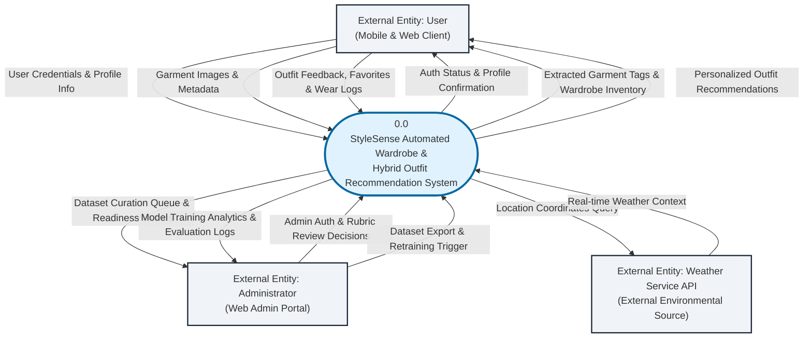
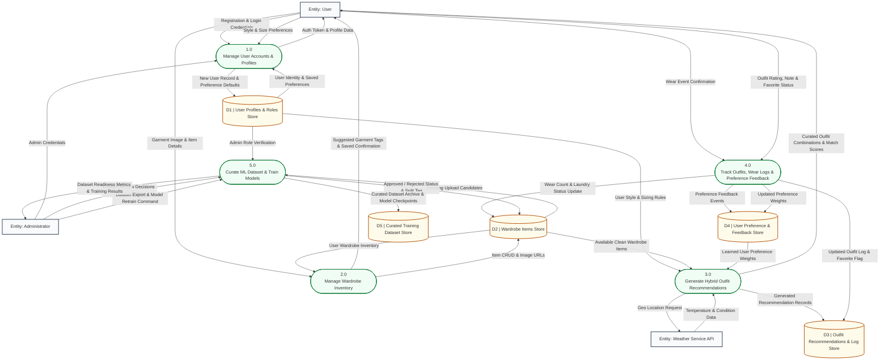
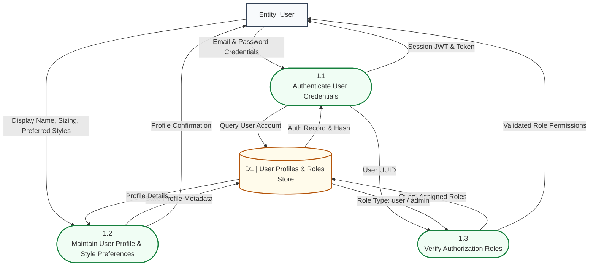
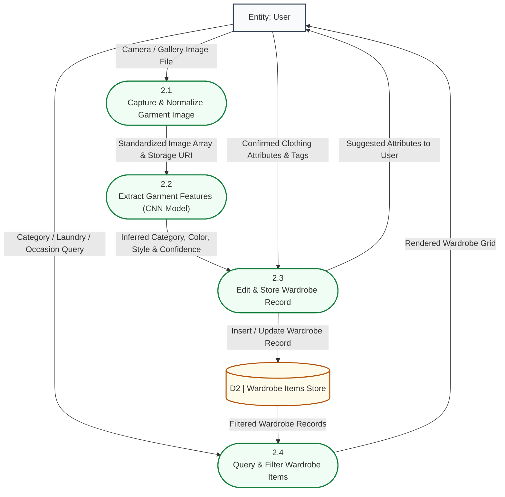
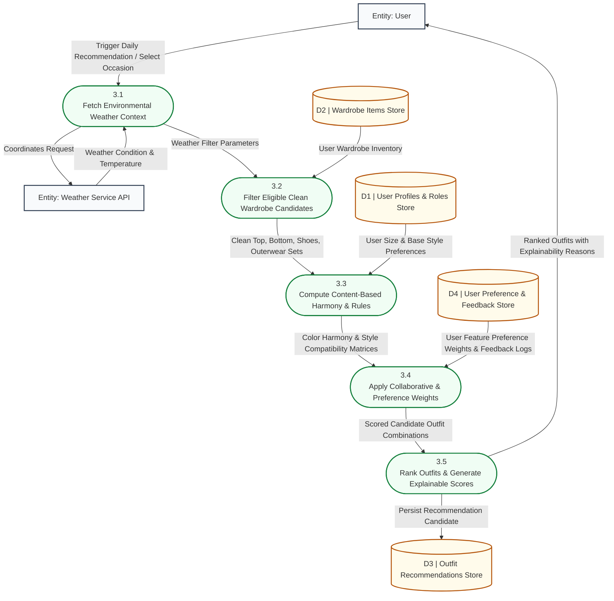
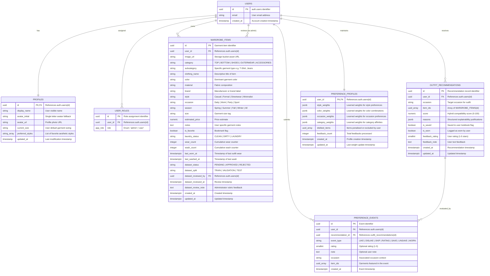

# StyleSense: System Architecture Diagrams & Data Dictionary

This document provides the formal architectural documentation for **StyleSense: Automated Wardrobe Management and Hybrid Outfit Recommendation System**, adhering strictly to the systems analysis and design standards, **Gane & Sarson DFD notation**, and **Crow's Foot ERD notation** as guided by Instructor Era Marie Gannaban.

---

## Table of Contents
1. [Overview & Architectural Context](#1-overview--architectural-context)
2. [Process Modeling Rules & Gane & Sarson Notation Guide](#2-process-modeling-rules--gane--sarson-notation-guide)
3. [Context Diagram (Environmental Level)](#3-context-diagram-environmental-level)
4. [Level 0 DFD (Parent Diagram)](#4-level-0-dfd-parent-diagram)
5. [Level 1 Child DFDs (Subsystem Decompositions)](#5-level-1-child-dfds-subsystem-decompositions)
   - [5.1 Process 1.0: User Account & Profile Management](#51-process-10-user-account--profile-management)
   - [5.2 Process 2.0: Wardrobe Inventory Management](#52-process-20-wardrobe-inventory-management)
   - [5.3 Process 3.0: Hybrid Outfit Recommendation Engine](#53-process-30-hybrid-outfit-recommendation-engine)
   - [5.4 Process 4.0: Outfit History, Wear Logging & Preference Feedback](#54-process-40-outfit-history-wear-logging--preference-feedback)
   - [5.5 Process 5.0: Dataset Curation & Model Retraining](#55-process-50-dataset-curation--model-retraining)
6. [Entity-Relationship Diagram (Crow's Foot Notation)](#6-entity-relationship-diagram-crows-foot-notation)
7. [Comprehensive Data Dictionary](#7-comprehensive-data-dictionary)
   - [7.1 Data Flow Specifications](#71-data-flow-specifications)
   - [7.2 Data Store Specifications](#72-data-store-specifications)
   - [7.3 Process Specifications (Mini-Specs)](#73-process-specifications-mini-specs)
8. [Excalidraw Whiteboard Reference](#8-excalidraw-whiteboard-reference)

---

## 1. Overview & Architectural Context

StyleSense is composed of:
1. **Mobile Application (`stylesense-mobile`)**: The client interface for users to capture garment images via camera, manage their digital wardrobe, view daily outfit recommendations, and submit preference ratings.
2. **Web Portal & Admin Workspace (`destini---shadow-to-star`)**: The portal providing administrative oversight, dataset review workflows for CNN readiness, ML training pipeline triggers, and evaluation analytics.
3. **Backend API & Data Layer (Node.js/Express & Supabase PostgreSQL)**: Provides secure REST endpoints, Row-Level Security (RLS) enforcement, object storage for clothing images, and relational data management.
4. **Machine Learning & Recommendation Services**: 
   - **Computer Vision (CNN / ResNet)**: Automated garment category, color, and style extraction.
   - **Hybrid Recommendation Engine**: Blends content-based feature filtering (color harmony, style rules, weather suitability) with collaborative filtering and learned user preference profiles.

---

## 2. Process Modeling Rules & Gane & Sarson Notation Guide

The diagrams in this document strictly adhere to the following modeling rules:

| Element | Gane & Sarson Symbol | Modeling Rules Followed |
| :--- | :--- | :--- |
| **Process** | Rounded Rectangle with top ID section | • Must have at least one input and one output.<br>• Labeled with an active **Verb + Noun** phrase.<br>• No **Black Holes** (outputs with no inputs) or **Gray Holes** (insufficient inputs).<br>• Level 0 contains **5 processes** (within the maximum limit of 7). |
| **External Entity** | Square / Double-lined Rectangle | • Represents external sources and sinks (User, Admin, Weather API).<br>• Connects **only** to processes (never directly to data stores or other entities). |
| **Data Store** | Open-ended Horizontal Rectangle | • Labeled with plural noun phrase (e.g., `Wardrobe Items Store`).<br>• Must have at least one incoming (write/update) and one outgoing (read/retrieve) data flow.<br>• Never connects directly to another data store or external entity. |
| **Data Flow** | Labeled Directional Arrow | • Labeled with concise noun phrases (e.g., `Garment Metadata`, `Weather Context`).<br>• Diverging arrows represent the same data flow routed to multiple processes. |

---

## 3. Context Diagram (Environmental Level)

The Context Diagram defines the environmental boundary of the StyleSense system, its interactions with external actors, and the core boundary inputs and outputs.

### Diagram: Context Diagram


---

## 4. Level 0 DFD (Parent Diagram)

The Level 0 DFD decomposes System 0.0 into **five (5) balanced functional processes**, **five (5) primary data stores**, and **three (3) external entities**.

### Diagram: Level 0 DFD (Parent Diagram)


---

## 5. Level 1 Child DFDs (Subsystem Decompositions)

### 5.1 Process 1.0: User Account & Profile Management
Decomposes the authentication, role verification, and profile management pipeline.



---

### 5.2 Process 2.0: Wardrobe Inventory Management
Decomposes garment image capture, automated CNN attribute extraction, and inventory maintenance.



---

### 5.3 Process 3.0: Hybrid Outfit Recommendation Engine
Decomposes the hybrid recommendation process combining Content-Based Filtering, Collaborative Filtering / Preference Learning, and Weather Context.



---

### 5.4 Process 4.0: Outfit History, Wear Logging & Preference Feedback
Decomposes wear logging, laundry status updating, user feedback capture, and dynamic preference profile updating.

```mermaid
flowchart TD
    classDef entity fill:#f8fafc,stroke:#334155,stroke-width:2px;
    classDef process fill:#f0fdf4,stroke:#15803d,stroke-width:2px,rx:10px,ry:10px;
    classDef datastore fill:#fffbeb,stroke:#b45309,stroke-width:2px;

    E1["Entity: User"]:::entity
    D2[("D2 | Wardrobe Items Store")]:::datastore
    D3[("D3 | Outfit Recommendations Store")]:::datastore
    D4[("D4 | User Preference & Feedback Store")]:::datastore

    P4_1(["4.1<br/>Log Outfit Wear Event"]):::process
    P4_2(["4.2<br/>Manage Saved & Favorite Outfits"]):::process
    P4_3(["4.3<br/>Capture Rating & Feedback Event"]):::process
    P4_4(["4.4<br/>Update Dynamic User Preference Weights"]):::process

    E1 -->|Mark Outfit As Worn| P4_1
    P4_1 -->|Increment Wear Count & Set Last Worn| D2
    P4_1 -->|Update is_worn Flag in Recommendation| D3

    E1 -->|Toggle Favorite / Save Outfit| P4_2
    P4_2 -->|Update is_saved Flag| D3

    E1 -->|Submit Star Rating (1-5), Note, or Like/Dislike| P4_3
    P4_3 -->|Insert Preference Event Record| D4
    P4_3 -->|Update Feedback Fields in Recommendation| D3
    P4_3 -->|Trigger Profile Re-weighting| P4_4

    P4_4 -->|Read Historical Feedback Events| D4
    P4_4 -->|Recalculate Style/Color/Occasion Weights| D4
```

---

### 5.5 Process 5.0: Dataset Curation & Model Retraining
Decomposes the administrator dataset review queue, rubric verification, training export, and CNN fine-tuning workflow.

```mermaid
flowchart TD
    classDef entity fill:#f8fafc,stroke:#334155,stroke-width:2px;
    classDef process fill:#f0fdf4,stroke:#15803d,stroke-width:2px,rx:10px,ry:10px;
    classDef datastore fill:#fffbeb,stroke:#b45309,stroke-width:2px;

    E2["Entity: Administrator"]:::entity
    D2[("D2 | Wardrobe Items Store")]:::datastore
    D5[("D5 | Curated Training Dataset Store")]:::datastore

    P5_1(["5.1<br/>Queue & Inspect Upload Candidates"]):::process
    P5_2(["5.2<br/>Evaluate Candidates Against Rubric"]):::process
    P5_3(["5.3<br/>Update Dataset Status & Split"]):::process
    P5_4(["5.4<br/>Export Curated Corpus & Trigger CNN Retraining"]):::process

    D2 -->|Fetch PENDING Image Uploads & Metadata| P5_1
    P5_1 -->|Render Review Queue with Image Previews| E2

    E2 -->|Apply Rubric: Clarity, Bounding, Correct Label| P5_2
    P5_2 -->|Approval / Rejection Verdict & Notes| P5_3
    P5_3 -->|Set dataset_status (APPROVED/REJECTED) & Split| D2

    E2 -->|Trigger Export (Min 200 items/category threshold)| P5_4
    D2 -->|Read APPROVED Garment Records| P5_4
    P5_4 -->|Export Stratified Train/Val/Test Dataset Archive| D5
    P5_4 -->|Execute PyTorch CNN Fine-Tuning Script| D5
    P5_4 -->|Report Validation Macro-F1 & Category Metrics| E2
```

---

## 6. Entity-Relationship Diagram (Crow's Foot Notation)

The ERD specifies all database entities, primary keys (PK), foreign keys (FK), attributes, and their relationships matching the PostgreSQL/Supabase schema and DFD data stores.

### Diagram: Crow's Foot ERD


---

## 7. Comprehensive Data Dictionary

### 7.1 Data Flow Specifications

| Data Flow Name | Source | Destination | Data Composition / Attributes |
| :--- | :--- | :--- | :--- |
| **User Credentials** | User (E1) | 1.1 Authenticate User | `{ email: String, password: String }` |
| **Auth Token & Profile Data** | 1.1 Authenticate User | User (E1) | `{ token: JWT, user: { id: UUID, email: String, role: String } }` |
| **Profile Metadata** | User (E1) | 1.2 Maintain Profile | `{ display_name: String, current_size: String, preferred_styles: Array<String> }` |
| **Garment Image Upload** | User (E1) | 2.1 Normalize Image | `{ file: Binary/JPEG, user_id: UUID, file_name: String }` |
| **Extracted Garment Features**| 2.2 Extract Features | 2.3 Store Item | `{ category: String, color: String, style: String, confidence: Float }` |
| **Wardrobe Item Record** | 2.3 Store Item | D2 (Wardrobe Store) | `{ id: UUID, user_id: UUID, clothing_name: String, category: String, color: String, style: String, image_url: String, laundry_status: String }` |
| **Location Query** | 3.1 Fetch Weather | Weather API (E3) | `{ latitude: Float, longitude: Float, api_key: String }` |
| **Weather Context** | Weather API (E3) | 3.1 Fetch Weather | `{ temperature: Float, condition: String, humidity: Float, precipitation: Boolean }` |
| **Eligible Garment Sets** | 3.2 Filter Candidates| 3.3 Compute Harmony | `{ tops: Array<Item>, bottoms: Array<Item>, shoes: Array<Item>, outer: Array<Item> }` |
| **Preference Weights** | D4 (Preference Store)| 3.4 Apply Weights | `{ style_weights: JSON, color_weights: JSON, occasion_weights: JSON }` |
| **Outfit Recommendation** | 3.5 Rank Outfits | User (E1) | `{ id: UUID, item_ids: Array<UUID>, score: Numeric, reasons: Array<String> }` |
| **Wear Event Record** | User (E1) | 4.1 Log Wear Event | `{ recommendation_id: UUID, item_ids: Array<UUID>, date_worn: Timestamp }` |
| **Feedback Event Record** | User (E1) | 4.3 Capture Feedback| `{ recommendation_id: UUID, event_type: Enum, rating: Integer, note: String }` |
| **Admin Rubric Decision** | Administrator (E2)| 5.3 Update Status | `{ item_id: UUID, dataset_status: 'APPROVED'\|'REJECTED', dataset_split: 'TRAIN'\|'VAL', note: String }` |
| **Curated Dataset Archive** | 5.4 Export Dataset | D5 (Dataset Store) | `{ images_dir: Path, labels_csv: File, category_counts: Map<String, Integer> }` |

---

### 7.2 Data Store Specifications

| Store ID | Data Store Name | Primary Entity / Table | Description & Storage Structure |
| :--- | :--- | :--- | :--- |
| **D1** | User Profiles & Roles Store | `auth.users`, `public.profiles`, `public.user_roles` | Stores authenticated user identities, personal settings, default sizing, style preferences, and access roles (`user`, `admin`). |
| **D2** | Wardrobe Items Store | `public.wardrobe_items`, Supabase Storage (`wardrobe-images`) | Stores user clothing inventory records, attributes (color, style, category, fabric), image URLs, laundry status, wear counters, and moderation flags. |
| **D3** | Outfit Recommendations Store| `public.outfit_recommendations` | Stores generated outfit combinations, hybrid compatibility scores, explainability justifications, bookmark flags, and wear status. |
| **D4** | User Preference & Feedback Store| `public.preference_profiles`, `public.preference_events` | Stores individual user taste vectors (style/color/occasion weights) and atomic interaction events (`LIKE`, `DISLIKE`, `RATING`, `SAVE`, `WORN`). |
| **D5** | Curated Training Dataset Store| ML Service Local / Cloud Dataset Storage | Stores reviewed and approved garment training images organized by stratified splits (`TRAIN`, `VALIDATION`, `TEST`) and trained model weights. |

---

### 7.3 Process Specifications (Mini-Specs)

#### Process 3.0: Generate Hybrid Outfit Recommendations
```text
INPUT:
  - User_ID
  - Target_Occasion (Optional, defaults to 'Daily')
  - User_Coordinates (Lat, Long)
  - Clean_Wardrobe_Items from D2
  - Style_Preferences & Sizing from D1
  - User_Preference_Weights from D4
  - Real-time Weather_Data from E3

ALGORITHM / LOGIC:
  1. Determine current weather classification:
     - Warm (>24°C): Prioritize breathable fabrics, lightweight tops, shorts/skirts.
     - Mild (16°C-24°C): Standard layers, t-shirts, jeans, sneakers.
     - Cold (<16°C): Require Outerwear (jackets, coats), long pants, boots.
  2. Filter Wardrobe items where user_id == User_ID AND laundry_status == 'CLEAN'.
  3. Group items into Category buckets: [Tops, Bottoms, Shoes, Outerwear, Accessories].
  4. Form candidate outfit tuples: Outfit = (Top, Bottom, Shoes, [Outerwear]).
  5. Content-Based Scoring (S_cb):
     - Calculate Color Harmony (Complementary, Analogous, Monochromatic, Neutral matching).
     - Calculate Occasion Suitability (match garment.occasion with Target_Occasion).
     - Calculate Weather Compatibility (match garment.season/material with Weather).
  6. Collaborative & Preference Scoring (S_cf):
     - Multiply item attribute vector with user's learned Style_Weights and Color_Weights from D4.
     - Apply penalty factor (-1.0) if any item exists in disliked_items list.
  7. Compute Final Hybrid Score:
     - Score = (0.55 * S_cb) + (0.45 * S_cf)
  8. Generate Structured Explainability Reasons:
     - e.g., ["Matches your preferred Streetwear style", "Monochromatic navy color palette", "Optimal for sunny 28°C weather"].
  9. Rank candidates in descending order of Score.
  10. Persist Top-N recommendations into D3.

OUTPUT:
  - Top-N Recommended Outfits returned to User (E1).
```

---

## 8. Excalidraw Whiteboard Reference

The complete visual, handdrawn representation of all these diagrams has been compiled into the accompanying native Excalidraw file:
- **File**: `docs/stylesense_system_diagrams.excalidraw`

You can open this file in [Excalidraw](https://excalidraw.com) or share it directly during defense presentations, paper submissions, and class whiteboard reviews.

